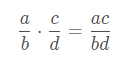
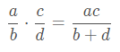
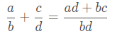
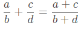

抽象代数的代码实现（2）域

# 域
上一篇文章讲了群的概念，现在来介绍一下域的概念。群是一个集合和运算，集合中元素的运算满足群的4条性质。相比群来说，域增加了一个运算，假设有集合A，运算{+}，运算{・}，如果集合A对{+}运算做成一个群，称作加法群，加法群A中的单位元称为零元，A中去除零元后的集合对{・}运算也做成一个群,并且+和・满足分配律，即

 a・(b+c) = a・b+a・c
 
那么我们把A叫做一个域，要注意+和・不一定是我们熟知的加法和乘法，也可以定义成其他运算，只要满足域的性质就行了，通常按照习惯，{・}运算在表达时可以省略。接下来举两个常见域的常见例子。

## 有理数域
有理数是我们比较熟悉的一个例子，所有有理数的集合对加法和乘法做成一个域。整数的集合并不是一个域，例如3这个数对于乘法来说在整数范围内并不存在逆元，但是在有理数范围内就存在逆元1/3，而有理数是一个域，可以举一些有理数的加法和乘法运算

加法组成一个群：

   - 结合律     
   例如 (5/4+（2/1+4/3）=(5/4+2/1)+4/3 = 55/12
   - 单位元（零元）     
     例如0+3/2 = 3/2       
   - 有逆元     
      例如3/2的逆元是-3/2
      
除0外乘法组成一个群：

- 结合律          
 (5/4・（2/1・4/3）=(5/4・2/1)?4/3 = 40/12  = 10/3
 - 单位元（1）       
     例如1・3/2 = 3/2    
 - 有逆元        
      例如3/2的逆元是2/3,因为(3/2)・(2/3)=1
## 剩余类
设p是素数，以p为模的剩余类组成一个域，后面的代码会说明为什么p是素数。例如p=5，则剩余类{0,1,2,3,4}是一个域。

加法组成一个群：

   - 结合律       
   例如 0+(1+2)=(0+1)+2=0
   - 单位元（0）    
     例如0+2 = 2          
   - 有逆元      
      例如1的逆元是4
      
除0外乘法组成一个群：

- 结合律      
1・(3・4)=(1・3）・4 = 12(mod 5) = 2
 - 单位元（1）     
     例如1・4 = 4
  - 有逆元      
      例如2的逆元是3,因为2・3=6（mod 5） = 1
    
 #  代码实现
## 有理数域

先定义域的结构体：
```c
struct FieldSys
{
    OperateSys *pGroup1;//加法群
    OperateSys *pGroup2;//乘法群
};
```
有理数元的结构体如下，由分子、分母、正负符号组成：

```c
typedef struct FieldEle FieldEle;
struct FieldEle
{
    u32 nmrtr;//分子
    u32 dnmtr;//分母
    u8 eSymb;//符号
};

```
接下来就要实现加法群和乘法群的相关函数。为了简单点，这里先不考虑溢出这些细节，把生成的数限制在100以内。代码的实现都非常简单，这里只列出接口，具体代码略去。

加法群：

```c
//这里生成自然数，也可以RationGen生成有理数
FieldEle *NatureGen(OperateSys *pOpSys,u32 num) 
//有理数加法
FieldEle *RationPlusOp(FieldEle *p1,FieldEle *p2)
//判断有理数是否相等
int RationEqual(FieldEle *p1, FieldEle *p2)
//有理数加法取逆，即取负号
FieldEle *RationPlusInv(FieldEle *p1)
```


乘法群：
```c
//有理数的生成，由于需要分子、分母、符号3个参数，这里只有一个，
//另外2个放在pOpSys里，参数都限制在100以内，要注意不能生成0
FieldEle *RationGen(OperateSys *pOpSys,u32 num)
//有理数乘法
FieldEle *RationMultOp(FieldEle *p1,FieldEle *p2)
//有理数求逆
FieldEle *RationMultInv(FieldEle *p1)
//判断有理数是否相等
int RationEqual(FieldEle *p1, FieldEle *p2)

```
## 剩余类域
先定义剩余类结构体

```c
typedef struct ModEle ModEle;
struct ModEle
{
    u32 num;//自然数
    u32 mod;//取模
};
```

和上面类似实现加法群和乘法群的相关接口，这里以模5的剩余类为例

加法群：

```c
OperateSys *ModPlusObj(void)
{
    static ModEle baseItem =
    {
        0,
        5,
    };

    static OperateSys plus;
    memset(&plus,0,sizeof(plus));

    plus.pBaseEle = &baseItem;
    plus.nPara = 1;
    plus.xIsEqual = (void*)ModEqual;
    plus.xGen = (void*)ModNumGen;
    plus.xInvEle = (void*)ModPlusInv;
    plus.xOperat =  (void*)ModPlus;

    return &plus;
}
```

乘法群：

```c
OperateSys *ModMultObj(void)
{
    static ModEle baseItem =
    {
        1,
        5,
    };

    static OperateSys mult;
    memset(&mult,0,sizeof(mult));

    mult.pBaseEle = &baseItem;
    mult.nPara = 1;
    mult.isMult = 1;
    mult.xIsEqual = (void*)ModEqual;
    mult.xGen = (void*)ModNumGen;
    mult.xInvEle = (void*)ModMultInv;
    mult.xOperat =  (void*)ModMult;

    return &mult;
}
```
其他都很简单，这里主要说一下乘法求逆元的算法，根据费马定理如果a和p的最大公约数是1,那么a^(p-1)≡1（mod p）,即a*a ^(p-2)≡1（mod p）,因此a的逆元就是a ^(p-2),所以代码如下

```c
ModEle *ModMultInv(ModEle *p1)
{
    ModEle *p;
    int i;
    u32 mod = p1->mod;
    p = malloc(sizeof(ModEle));
    memset(p,0,sizeof(ModEle));

    p->mod = mod;
    p->num = 1;
    for(i=0; i<mod-2; i++)
    {
        p->num = (p->num*p1->num)%mod;
    }

    return p;
}
```
## 域的证明
只需要证明加法是群，乘法是群，加法和乘法之间满足分配律

```c
void IsGroup(OperateSys *pOpSys)
{
    AssociativeLaw(pOpSys);
    HasIdentityEle(pOpSys);
    HasInvEle(pOpSys);
}

void IsField(FieldSys *pField)
{
    IsGroup(pField->pGroup1);//加法成群
    IsGroup(pField->pGroup2);//乘法成群
    DistributiveLaw(pField);//分配律
}
```
有了这些证明之后就可以解决一些奇怪的问题，比如

为什么分数的乘法是这么算的    
   
而不是    
          
我们可以把分数的乘法实现改成第2种形式，那么在证明乘法群时HasIdentityEle(pOpSys);函数会触发断言，单位元和任何元素相乘都不变

```c
        pGen = pOpSys->xGen(pOpSys,k);//生成一个元素
        pEle = pOpSys->xOperat(pOpSys->pBaseEle,pGen);//该元素和单位元相乘后的结果
        rc = pOpSys->xIsEqual(pGen,pEle);//是否相等
        assert( rc );
```
又比如分数的加法很奇怪，为什么是这么算的    
      
而不是下面这种更符合直觉的算法呢      
      
因为如果按照第2种算法，那么就会触发下面分配律的断言

```c
        //随机生成3个元素
        for(j=0; j<3; j++)
        {
            k = FakeRand(i+j*10);
            SetGenPara(pMult,k);
            pT[j] = pMult->xGen(pMult,k);
        }
        //后2个元素相加再和第1个元素相乘
        pT[3] = pLus->xOperat(pT[1],pT[2]);
        pT[4] = pMult->xOperat(pT[0],pT[3]);
        //第一个元素分别于后2个元素相乘再相加
        pT[5] = pMult->xOperat(pT[0],pT[1]);
        pT[6] = pMult->xOperat(pT[0],pT[2]);
        pT[7] = pLus->xOperat(pT[5],pT[6]);
        //结果不变
        rc = pMult->xIsEqual(pT[4],pT[7]);
        assert( rc );
```
最后要求模p的剩余类是一个域，为什么只有p是素数才成立，为了说明这个问题，我们可以在乘法初始化中把模改为4

```c
    static ModEle baseItem =
    {
        1,
        4,
    };
```
但这样运行代码后， 就会在函数HasInvEle中触发乘法存在可逆元的断言，因为对于2不存在元素x使得2*x≡1（mod 4）

# 参考代码
具体实现的代码细节见    
https://github.com/pfysw/CMath/tree/master/Algebra
