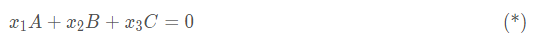
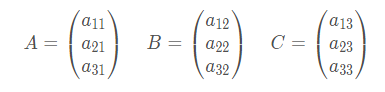
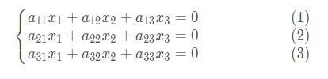

# 向量空间
## 概念定义
上篇文章介绍了域，域可以简单的理解为一个有理数集合，这个集合中有加法运算和乘法运算，运算后的结果是封闭的，还是有理数。接下来我们从这个集合中取出n个元素，这n个元素组成一个有顺序的子集，这个子集称为n维向量。

设a、b、c是有理数，那么(a b c)是一个三维向量。所有向量组成的集合称为V，假设有理数集合为K，V中的元素为A、B、C……如果下面的运算成立，那么把V称为K上的向量空间

 - a(A+B) = aA + aB
 - (a + b)A = aA + bA
 - a(bA) = (ab)A
 - 1A = A
 
 # 代码实现
 
在上篇文章中已经定义了有理数域的数据结构，采用分数的形式，但是经过多次加减乘除运算后会产生溢出，为了避免这个麻烦，我们采用浮点型来表示

```c
struct FieldEle
{
    u32 nmrtr;//分子
    u32 dnmtr;//分母
    float val;
    u8 eSymb;
};
```
向量的结构体可以看做是由FieldEle元素组成的数组

```c
struct VectorEle
{
    int nEle;  //数组元素个数
    FieldEle **aVecEle;//存放有理数域的数组
};
```
现在来定义VectorEle向量的加法，只需把aVecEle每个对应的元素相加，有理数域中的元素与向量相乘时，只要把该元素分别与aVecEle的每个元素相乘，下面证明这样定义的VectorEle是一个向量空间

首先证明a(A+B) = aA + aB，代码如下

```c
int VectorDist1(FieldSys *pField,int nEle)
{
    int rc = 0;
    int i,j,l;
    u32 k;
    FieldEle* pFieldEle;
    OperateSys *pMult = pField->pGroup2;
    VectorEle *pVector[2];
    VectorEle *pV[5];

    //随机测试10组数据
    for(i=0; i<10; i++)
    {
        //随机生成一个有理数
        k = FakeRand(i+j*10);
        SetGenPara(pMult,k);
        pFieldEle = pMult->xGen(pMult,k);
        //随机生成2个向量
        for(j=0; j<2; j++)
        {
            pVector[j] = (VectorEle *)malloc(sizeof(VectorEle));
            memset(pVector[j],0,sizeof(VectorEle));
            pVector[j]->nEle = nEle;
            pVector[j]->aVecEle = malloc(nEle*sizeof(void *));
            for(l=0;l<nEle; l++)
            {
                k = FakeRand(i+j+l);
                SetGenPara(pMult,k);
                pVector[j]->aVecEle[l] = pMult->xGen(pMult,k);
            }
        }
        //计算A+B
        pV[0] = VectorPlus(pField,pVector[0],pVector[1]);
         //计算a(A+B)
        pV[1] = FieldMultVector(pField,pFieldEle,pV[0]);
        //计算aA
        pV[2] = FieldMultVector(pField,pFieldEle,pVector[0]);
        //计算aB
        pV[3] = FieldMultVector(pField,pFieldEle,pVector[1]);
        //计算aA+aB
        pV[4] = VectorPlus(pField,pV[2],pV[3]);
        //验证是否相等
        rc = isVecotrEqual(pField,pV[1],pV[4]);
        FreeVector(pVector[0]);
        FreeVector(pVector[1]);
        for(j=0; j<5; j++)
        {
            FreeVector(pV[j]);
        }
        assert( rc );
    }
    loga("vector Distributive1 ok %d",rc);
    return rc;
}
```

其他几条性质的证明类似，接口如下

```c
void isVectorSpace(FieldSys *pField,int nEle)
{
    //a(A+B) = aA + aB
    VectorDist1(pField,nEle);
    //证明(a + b)A = aA + bA
    VectorDist2(pField,nEle);
    //a(bA)=(ab)A
    VectorAsso(pField,nEle);
    //1A=A
    VectorIdentity(pField,nEle);
}

```
# 线性相关
有了向量空间的概念后，再来介绍一个非常重要的概念也就是线性相关。假如给定向量A、B、C，如果方程           
        
 的解x1,x2,x3,不全为0，那么我们我们说向量A、B、C线性相关，线性相关的意义就是这3个向量中每一个可以由另外2个向量表示了，类似的线性相关的个数可以推广到更多。    

现在我们来判断给定一个向量组，判断是否是线性相关，如果这是一个三维向量空间，那么假定
      
那么(*)式的解也就是，下列方程组的解

       
求解时采用的是消元法，先把方程（2）和方程（3）减去方程（1）乘以相关系数，消掉x1，再递归求解方程(2)和方程（3）组成的2元方程，代码如下

```c
int isLinearDepedent(
        FieldSys *pField,
        VectorEle **paVector,//输入的向量组
        int n,//n个变量
        int iRow,//输入的方程起始编号
        int nRow)//输入的方程个数
{
    int rc = 0;
    int i,j;
    OperateSys *pPlus = pField->pGroup1;
    FieldEle **paEle;
    FieldEle *pTemp;
    FieldEle *pTempEle;

    assert(n>0);
    assert(nRow>0);
    if( n==1 )
    {
        //不断消元递归后只剩一个变量，可能还有多个方程
        paEle= (FieldEle **)&((paVector[0])->aVecEle[iRow]);
        for(i=0; i<nRow; i++)
        {
            //线性变换后，最后一列有非零元素，所以不可能存在非零解，线性无关
            if( !pPlus->xIsEqual(paEle[i],pPlus->pBaseEle) )
            {
                return 0;
            }
        }
        //如果最后一列系数全是0，那么有非零解，线性相关
        return 1;
    }
    else if( nRow==1 )
    {
        //只剩一行，但是未知变量大于1，那么必定有非零解
        return 1;
    }
    else
    {
        paEle = (FieldEle **)&((paVector[0])->aVecEle[iRow]);
        for(i=0; i<nRow; i++)
        {
            //找到第1列的非0元素，换到第一行
            if( !pPlus->xIsEqual(paEle[i],pPlus->pBaseEle) )
            {

                for(j=0;j<n;j++)
                {
                    paEle = (FieldEle **)&((paVector[j])->aVecEle[iRow]);
                    pTempEle = paEle[i];
                    paEle[i] = paEle[0];
                    paEle[0] = pTempEle;
                }
                break;
            }
        }
        paEle = (FieldEle **)&((paVector[0])->aVecEle[iRow]);
        //如果第一列的元素全为0，那么忽略这一列，递归下一列
        //todo 此时是否可以直接认定为线性相关
        if( pPlus->xIsEqual(paEle[0],pPlus->pBaseEle) )
        {
            rc = isLinearDepedent(pField,&paVector[1],n-1,iRow,nRow);
        }
        else
        {
            for(i=1; i<nRow; i++)
            {
                paEle = (FieldEle **)&((paVector[0])->aVecEle[iRow]);
                pTemp = FiledDiv(pField,paEle[i],paEle[0]);
                //pTemp是后面方程的元素与第1个方程元素的比值
                for(j=0;j<n;j++)
                {
                    paEle = (FieldEle **)&((paVector[j])->aVecEle[iRow]);
                    //根据这个比值校园
                    paEle[i] = EliminationUnkowns(pField,paEle[i],paEle[0],pTemp);
                }
                free(pTemp);
            }
            //消去第一个变量后，递归下一列和下一行，重新执行以上步骤
            rc = isLinearDepedent(pField,&paVector[1],n-1,iRow+1,nRow-1);
        }
    }

    return rc;
}
```
# 参考代码
https://github.com/pfysw/CMath