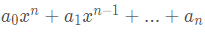
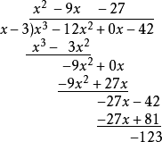
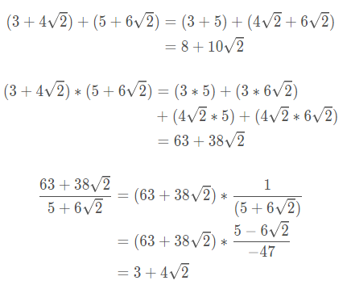
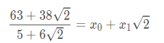
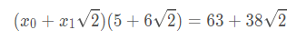
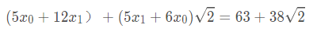
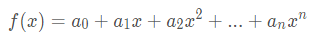
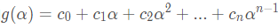
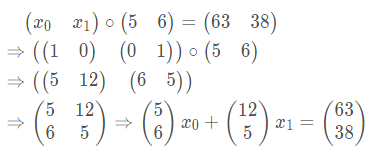

抽象代数的代码实现（4）多项式与代数扩域

在实现多项式运算的代码时，突然觉得抽象急剧增加，感觉我的大脑要到极限了，写的代码完全就是调试出来的，对于代码的结构我自己都感到有点模糊，想表述清楚基本不可能了，凑活着说明一下吧。

现在我对抽象的理解是，一个符号，一个概念，它不一定就指的是我们常见的概念，也可以代入另外的概念，代入后的新系统与原系统有着某种相似性（同构），但是新系统的运算很难被直观理解。在这一点上C语言还是挺有优势的，同一个指针可以被我们解释成不同的概念，在结构上却可以进行着相同的操作。其他语言会把一些抽象封装在编译器或解释器里面，而c语言中所有抽象都要你自己编码处理，相对来说会增加编码的负担，但是大脑处理抽象的负担是减轻了的，因为你已经掌握了全部抽象的细节，对于抽象中的步骤调试很大一部分都交给了电脑，而不用在自己的大脑中调试。

在完成多项式模乘法求逆运算这段代码时，其实我是不太清楚代码是怎么写的，只有一种非常模糊的代码轮廓，然后在具体实现时结合调试把步骤清晰化，写代码时看看有哪些现成的函数可以用，没有的再自己编写，重复的代码尽量写到一个函数中复用，哪些信息缺少了则在结构体中添加，遇到程序崩溃或运行结果不符合预期再不断调试分析修改，这样我就写出了自己“不会写‘’的代码。我一直在思考怎么把人的这种主观能动性注入到软件中，其实一个软件中的信息是相当丰富的，但是它只会按照人写的代码来利用很少的一些信息，当人只给软件设定目标而未给出具体实现的代码时，软件能不能自己去寻找利用所有可用的信息，将目标大任务分解成软件自身能够处理的小任务逐一完成再合并，最后把完成任务的整个过程添加到自身的代码中以实现自我进化......

说了那么多废话，接下来开始实现多项式相关的具体代码

# 多项式
## 定义
先来看多项式的定义，形如  的表达式中，如果a0,a1,...an这些系数都是域K中的元且a0≠0，这表达式就称为K中的多项式。多项式的加法和乘法按照我们平常熟悉的来定义，现在x^0, x ^1,...x ^n分别用向量来表示，对应（1 0 ... 0）,（0 1 ... 0),...,（0 0 ... 1）,这样我们看到多项式的加法数乘运算与上一篇文章定义的向量的加法和数乘运算是等价的。接着扩充一下该向量空间的乘法和除法

## 乘法
我们按照多项式的乘法特征定义向量的乘法，假设有一个n维向量和一个m维向量相乘，例如(a1,a2...an)(b1,b2...bm) = (c1,c2,...,c_(n+m))，乘法的结果变为一个n+m维向量，ai乘以bj后，把所有下标之和（即i+j）相等的配对加在一起，在多项中即次数相等的项进行合并。代码如下

```c
VectorEle *VectorMult(
        FieldSys *pField,
        VectorEle *p1,
        VectorEle *p2)
{
    VectorEle *pVector;
    OperateSys *pMult = pField->pGroup2;
    OperateSys *pPlus = pField->pGroup1;
    FieldEle *pT[2];
    int i,j,k;
    int size;

    pVector = (VectorEle *)malloc(sizeof(VectorEle));
    memset(pVector,0,sizeof(VectorEle));
    pVector->nEle = p1->nEle+p2->nEle-1;
    size = pVector->nEle*sizeof(void *);
    pVector->aVecEle = malloc(size);
    memset(pVector->aVecEle,0,size);
    for(i=0;i<p1->nEle;i++)
    {
        for(j=0;j<p2->nEle;j++)
        {
            //两个多项式中的元素两两相乘
            //次数相等的项全部加在一起
            k = i+j;
            pT[0] = pMult->xOperat(p1->aVecEle[i],p2->aVecEle[j]);
            if( pVector->aVecEle[k]==NULL )
            {
                pVector->aVecEle[k] = pT[0];
            }
            else
            {
                pT[1] = pPlus->xOperat(pT[0],pVector->aVecEle[k]);
                free(pVector->aVecEle[k]);
                free(pT[0]);
                pVector->aVecEle[k] = pT[1];
            }
        }
    }
    return pVector;
}
```
## 除法
现在我们来实现多项式的除法，假设有多项式f(x)和g(x),f(x) 的次数大于g(x),假设f(x)=q(x)g(x)+r(x)，r(x)的次数小于g(x)那么我们称f(x)除以g(x)的商为q(x)，余式为r(x),算法步骤如下图所示。    

    
 
现在不关心商式的结果，代码实现主要是为了获得余式的结果，（注意：现在多项式前面的数是有理数，后面会讲到有理数可以通过向量空间的方式再扩充成令外一个域，所以多项式前面的系数可能是一个域中的元素也可能是域中元素组成的向量，如果系数是向量那么会有更多的细节要处理）

实现多项式除法取余的函数接口如下

```c
VectorEle *VectorMod(
        FieldSys *pField,
        VectorEle *p1,
        VectorEle *p2)
```
其中除式是p2，被除式是p1，p1的系数可能是向量也可能是有理数，p2的系数为有理数，在上面的除法运算图所示，先要求出p1的最高次项系数与p2的最高次项比值，代码中用pT[0]表示，相乘后得到余式继续重复以上步骤，余式用pTemp表示，重复以上步骤直到余式的最高次数小于除式p2，关键代码如下

```c
        //被除式p1的次数大于除式p2的次数
        //从p1的最高次数遍历到p2的最高次数
        //pTemp在之前已经初始化为p1的值了
        for(i=p1->nEle-1;i>=p2->nEle-1;i--)
        {
            if( pTemp->eType==p2->eType )
            {
                //除式最高次项系数与pTemp元的比值
                pT[0] = FiledDiv(pField,pTemp->aVecEle[i],
                        p2->aVecEle[p2->nEle-1]);
                for(j=i,l=p2->nEle-1;j>i-p2->nEle;j--,l--)
                {
                    //比值乘以最高次后做差消去最高次项
                    //留下次数降低的余式存放在pTemp上
                    pTemp->aVecEle[j] = EliminationUnkowns(pField,pTemp->aVecEle[j],
                                   p2->aVecEle[l],pT[0],0);
                }
                FreeGroupEle(pPlus,pT[0]);
            }
            else
            {
                //系数是向量的情况
            }
        }
```
# 代数域
## 代数元
有理数是一个域，现在想添加一个有理数域之外的元α，组成一个新的域，那么应该怎么添加呢，新元α有什么特点呢？现在就来利用上面介绍的多项式的知识来扩域:  

先给定一个多项式f(x)=x^2-2,   f(x)=0的根√2并不在有理数域中，那么怎么把√2添加进来组成一个新的域呢？方法是用a+b√2的数来组成一个新的集合，其中a和b都是有理数，为了直观一点，我们先做一些加减乘除的例子
      
在做除法时，可以看到分母中的√2可以被消去，于是结果又回到了a+b√2的形式，所以a+b√2是一个域。我们可以用另外一种方法做除法，仍然以上面的除法为例，不妨设      
           
要算出除法的结果，也就是求x0和x1使得              
            
把上式左边展开后，含√2的2次方项都可以是利用x^2-2=0这个性质来约掉，最后变成                 
    
这样我们只需解得一个2元2次方程即可，即x0=3，x1=4

好了，现在真正的抽象开始了，对于多项式             
    
系数ai都属于有理数域K，如果有某个元α使得f (α)=0,那么我们把α叫做K上的代数元，那么所有形如             
         
的元素将会组成一个域，记为K(α),显然K是域K(α)的子集,把K(α)叫做K上的α扩域，如上面举的例子，√2是x^ 2-2=0的根，K(√2) = a+b√2，K(√2) 是K上的√2扩域。这里注意到g(α)最高次项系数比f(x) 最高次系数小1，因为如果g(α)的最高次数大于n，那么可以除以f(α)取余式并注意到f (α)=0，约去后就得到次数小于n的多项式。现在用n个n维向量（1 0 ... 0）,（0 1 ... 0),...,（0 0 ... 1）来替换1，α，α^ 2....就得到了一个向量空间E，在这个向量空间中的乘法按照第一节所述即多项式的乘法，现在定义这个向量空间的新乘法°，也就是在原乘法的基础上再对f（x）代表的向量(a0,a1,...,an)取余，最后还是得到一个n维向量，可以看到在定义了新乘法后，向量空间E与g (α)是完全等价的，都是有理数域K上的扩充，扩充次数记做n，即f(x)的最高次项系数。

仍然以√2的扩充举例，a+b√2可以用向量表示为a(1 0)+b(0 1),即(a 0)+(b 0)。上面举的除法运算可以等价为求x0和x1使得向量方程（x0 x1）°(5 6）=（63 38）成立，其中°新乘法是对多项式f(x)=x ^2-2即向量（-2,0,1）取余，（x0 x1）°(5 6）的结果为（5x0,5x1+6x0,6x1）除以（-2,0,1）取余,按照多项式除法可以可以得到（5x1+6x0,5x0+12x1）=（63 38）,只要解出这个2元2次方程即可。
思路是上面这样，但是写成代码要涉及到未知变量x0和x1的表示问题，我们再用向量(1,0)表示x0，(0,1)表示x1，那么（x0 x1）°(5 6）就是（(1,0)  (0,1)）°(5 6），化简后变为（(6,5)  (5,12)）的形式。回到（5x1+6x0,5x0+12x1）=（63 38），现在除法的结果相当于求x0和x1使得满足x0(6 5)+x1(5 12)=（63 38）,最后把向量(6 5)，(5 12)，（63 38）输入到一个解方程的函数中，采用消元法，就可以得到x0和x1的值，所有步骤如下

     

上面的例子稍微有点不好，到矩阵这步后是经过转置后得到最后的向量，由于这个矩阵转置后不变所以看不出来。
## 代码实现
首先新建一个域，这个域里有多项式加法群和多项式乘法群，这个域里的元素是一个向量，向量中的元素属于子域pSubField，

```c
//元素类型
struct VectorEle
{
    int nEle;
    u8 eType;//指定aVecEle元素类型，不一定是数也可能是向量
    VectorEle *pPoly;
    FieldSys *pSubField;
    void **aVecEle;
    //FieldEle **aVecEle;
};

void SetVecField(
        FieldSys **ppField,
        FieldSys *pSubField,
        int nEle)//元素个数
{
    VectorEle *pPoly;
    *ppField = (FieldSys *)malloc(sizeof(FieldSys));
    pPoly = NewPolyVec(pSubField,nEle);//设置扩域的多项式

    //新建加法群和乘法群
    (*ppField)->pGroup1 = PolyPlusObj(pSubField,nEle,pPoly);
    (*ppField)->pGroup2 = PolyMultObj(pSubField,nEle,pPoly);

    pSubField->pParent = (*ppField);

}
```
新建群后就要实现群中的各种运算，加法运算也就是向量的加法运算，对应元素相加即可，比较简单，加法群接口如下

```c
    plus.xIsEqual = (void*)PolyEqual;
    plus.xGen = (void*)PolyGen;
    plus.xInvEle = (void*)PolyPlusInv;
    plus.xOperat =  (void*)PolyPlus;
```
乘法群的接口如下：

```c
    mult.xIsEqual = (void*)PolyEqual;
    mult.xGen = (void*)PolyGen;
    mult.xInvEle = (void*)PolyMultInv;
    mult.xOperat =  (void*)PolyMult;
```
乘法运算不只是向量的乘法运算，按照上面定义的新式乘法运算，运算结果还要对一开始输入的多项式pPoly取模，代码如下

```c
VectorEle *PolyMult(VectorEle *p1,VectorEle *p2)
{
    VectorEle *pV[2];
    FieldSys *pField = p1->pSubField;

    pV[0] = VectorMult(pField,p1,p2);
    pV[1] = VectorMod(pField,pV[0],p1->pPoly);
    pV[1]->pSubField = pField;
    pV[1]->pPoly = p1->pPoly;

    FreeVector(pV[0]);

    return pV[1];
}
```
最难的就是乘法求逆运算了，输入元p1求逆元，结果就是1除以p1，除法的步骤按照上面举的例子，很多细节就不讲了，这里要特别注意的一个地方是向量中的元素不一定是数，也可以是向量，代码如下

```c
VectorEle *PolyMultInv(VectorEle *p1)
{
    FieldSys *pField = p1->pSubField;
    OperateSys *pPlus = pField->pGroup1;
    OperateSys *pMult = pField->pGroup2;
    VectorEle *p;
    VectorEle *pV[4];
    VectorEle *pRight;
    int i,j;
    int rc;

    //根据给定的多项式创建向量空间，如给定x^2-2=0
    //则创建向量空间x0(1 0)+x1(0 1) = (x0 x1) = ((1 0) (0 1))
    //pV[0]是一个向量，它的元素也是一个向量（用来表示未知量）
    pV[0] = CreatUnkownPoly(pField,p1->pPoly);
    //输入的向量与pV[0] 相乘，例如输入(5 6)
    //则pV[1]为(5 6)((1 0) (0 1))，这里是普通的多项式乘法
    pV[1] = VectorMult(pField,p1,pV[0]);
    //上面的结果再除以输入的多项式p1->pPoly取余
    // 得到上面定义的新乘法结果(5 6)°((1 0) (0 1))
    pV[2] = VectorMod(pField,pV[1],p1->pPoly);
    //转置后得到一个列向量组
    pV[3] = VectorTran(pField,pV[2]);
    //方程的右边是一个单位元
    pRight = NewVector1(p1,p1->nEle);
    pRight->aVecEle[0] = pPlus->xOperat(pMult->pBaseEle,pPlus->pBaseEle);
    for(i=1;i<p1->nEle;i++)
    {
        pRight->aVecEle[i] = pPlus->xOperat(pPlus->pBaseEle,pPlus->pBaseEle);
    }
    p = NewVector1(p1,p1->nEle);//用来输出结果
    //把pV[3]和pRight输入到解线性方程函数中最后得到所需要的结果
    rc = SolveLinearEqu(pField,(VectorEle **)pV[3]->aVecEle,pRight,p,
            0,p1->nEle,0,p1->nEle);
    //释放临时向量
    for(i=0;i<4;i++)
    {
        FreeVector(pV[i]);
    }
    FreeVector(pRight);
    assert(rc);

    return p;
}
```
最后可以证明上面建立的多项式对象和运算是一个域，把这个域输入到下面的证明函数中验证成立，满足加法群，乘法群和分配律

```c
void IsField(FieldSys *pField)
{
    IsGroup(pField->pGroup1);
    IsGroup(pField->pGroup2);
    DistributiveLaw(pField);
}
```

# 参考代码
https://github.com/pfysw/CMath


