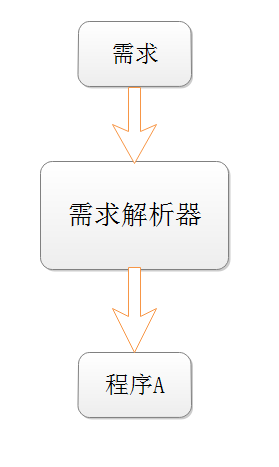
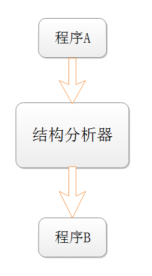
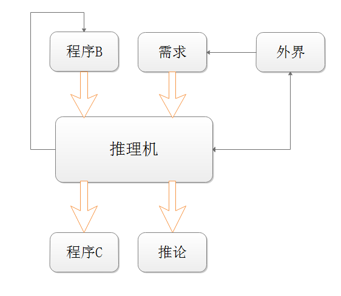

关于存在性问题的本质思考

在做《抽象代数的代码实现》这一专题时，我碰到数学概念难以用代码表达的问题，而这又很大程度上是由于数学上各种杂七杂八的存在性问题引起的，所以我想探究一下存在性问题到底是什么。在存在性问题解决之前先把这个专题暂停掉，因为以我现在的能力基本上挖掘不出什么东西，我需要先学习编译器，程序设计语言原理，范畴论等很多相关知识。

还是以最简单的存在性问题抽屉原理为例，把4个苹果放进3个抽屉，证明至少有一个抽屉里的苹果不少于2个。先来看一个最简单粗暴的方法，直接遍历所有的放法，这里使用递归，把这个程序记为A：

```c
//程序A
int TraversalBox(int *aBox, int index,int nBox,int nApple)
{
	int i;
	int rc = 0;
	for(i=0;i<nBox;i++)
	{
		if( index<nApple-1 )
		{
			aBox[i]++;
			rc = TraversalBox(aBox,index+1,nBox,nApple);
			aBox[i]--;
			if( rc )
			{
				break;
			}
		}
		else
		{
			aBox[i]++;		
			//所有苹果放完后，统计每个盒子里苹果的数量
			if( aBox[0]<2 && aBox[1]<2 && aBox[2]<2 )
			{
				rc = 1;
				break;
			}
			aBox[i]--;
		}
	}
	assert(!rc);
	return rc;
}
int PigeonholePrinciple(void)
{
	int nBox = 3;
	int nApple = 4;
	int aBox[3] = {0};
	int rc;

	//遍历4个苹果，每个苹果有3种放法
	rc = TraversalBox(aBox,0,nBox,nApple);

	return rc;
}
```

这里有一个问题，程序A所包含的信息就是描述需求的最小信息吗，如果不是，那么有没有一种描述需求的最小信息的语言，而且用这个语言编写需求的难度不会难于用文字表达，然后有一个需求解析器根据输入的需求信息生成程序A，示意图如下     
      
事实上人用文字表达的需求信息是不完全的，很多信息都是人们的共识不需要表达，而这一部分信息在需求解析器中是不存在的，所以需要提前添加。想做一个通用的需求解析器的难度基本上已经约等于做一个通用人工智能（AGI）了，但是我的关注焦点不在这上面，这里顺便提一下。

再回来重新分析程序A，为了证明至少有一个抽屉里的苹果不少于2个，遍历后用了3^4=81次计算，当规模增大时，计算量将指数增大，甚至很多场景中的数量都是无穷的，不可能通过遍历所有情况来完成判断。显然人不是这么做的，直觉上是先挖掘一些既定的事实信息，通过这些信息再进行推理得到最后的结论。

比如我们可以在程序中添加assert来表达一些既定的事实，在每一次放完苹果后，所有盒子的苹果总数为4，出现满足条件的情形时，则每个盒子里的苹果数小于2,3个盒子里苹果总数小于4，这个程序记为B，代码如下

```java
//程序B
int TraversalBox(int *aBox, int index,int nBox,int nApple)
{
	int i;
	int sum;
	int rc = 0;
	for(i=0;i<nBox;i++)
	{
		if( index<nApple-1 )
		{
			aBox[i]++;
			rc = TraversalBox(aBox,index+1,nBox,nApple);
			aBox[i]--;
			if( rc )
			{
				break;
			}
		}
		else
		{
			aBox[i]++;
			sum = aBox[0]+aBox[1]+aBox[2];
			//新增代码
			assert( sum==4 );//苹果总数为4
			
			if( aBox[0]<2 && aBox[1]<2 && aBox[2]<2 )
			{
			    //新增代码
				assert( aBox[0]<=1 );
				assert( aBox[1]<=1 );
				assert( aBox[2]<=1 );
				assert( sum == aBox[0]+aBox[1]+aBox[2] );
				assert( sum<4 );//苹果总数小于4
				rc = 1;
				break;
			}
			aBox[i]--;
		}
	}

	return rc;
}
```
看到上面的代码，在判断条件前我们已经断言了苹果总数为4，进入判断条件后，我们得出苹果总数小于4这个错误结论，也就是说明这个条件是进不去的。现在我们需要一个代码结构分析器对程序A的代码进行分析，进而挖掘出各种各样的断言。     
     
这个东西也特别难做，代码的结构有千万种，对应各种不同的断言，你不知道哪些断言是最关键的，所以最后还需要人工添加，甚至需要先确定目标后再重新去寻找有用的断言。

其实我最关心的还是，在获得程序B的各种断言后，怎么进行推理，根据结合需求来优化程序效率，并给出相应的结论。在程序B中，if( aBox[0]<2 && aBox[1]<2 && aBox[2]<2 )这个条件是永远进不去的，因为里面的断言会和之前的断言产生矛盾，这样rc就不会置1，也就是说明不可能有每个抽屉的苹果个数都小于2的放法，从而在得出结论后直接跳出循环，本来要执行81次的代码现在就执行一次，最后产生的效果是一样的，程序记为C，代码如下
```java
//程序C
int TraversalBox(int *aBox, int index,int nBox,int nApple)
{
	int i;
	int sum;
	int rc = 0;
	for(i=0;i<nBox;i++)
	{
		if( index<nApple-1 )
		{
			aBox[i]++;
			rc = TraversalBox(aBox,index+1,nBox,nApple);
			aBox[i]--;
			//新增代码
			assert( !rc );
			break;
		}
		else
		{
			aBox[i]++;
			sum = aBox[0]+aBox[1]+aBox[2];
			assert( sum==4 );//苹果总数为4
			
			if( aBox[0]<2 && aBox[1]<2 && aBox[2]<2 )
			{
				assert( aBox[0]<=1 );
				assert( aBox[1]<=1 );
				assert( aBox[2]<=1 );
				assert( sum == aBox[0]+aBox[1]+aBox[2] );
				assert( sum<4 );//苹果总数小于4
				rc = 1;
				break;
			}
			else
			{
			    //新增代码
				break;
			}
			aBox[i]--;
		}
	}
    //新增代码
    assert( !rc );
	return rc;
}
```

这个推理机的示意图如下，推理机甚至可以根据推理的进程让程序B生成更多的断言，有时候推理还需要和外界交互来提供更详细的需求信息     
     
这个推理机的难度也是无比巨大，现在我要做的就是把研究的焦点放在推理机的一小部分功能上，假如程序B的断言都给你了，怎么推出有价值的结论，如上根据assert( sum==4 )和assert( sum<4 );利用反证法可推出assert( !rc )，这样事实上就得到了一个非常有说服力的对存在性的证明，这个问题我觉得结合数理逻辑的知识还是有希望解决的。当然以我自己的智商解决这个问题真的是希望渺茫，如果有大神看到希望能提供一些好的思路。