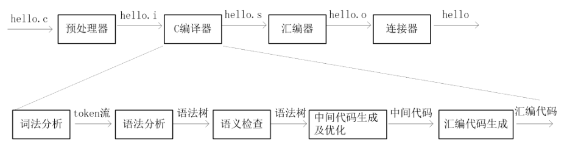
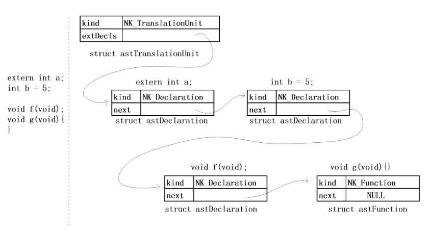
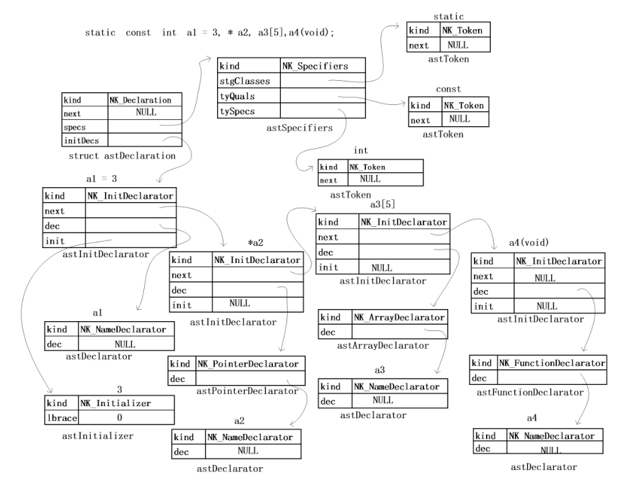
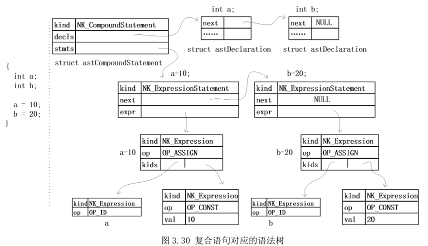
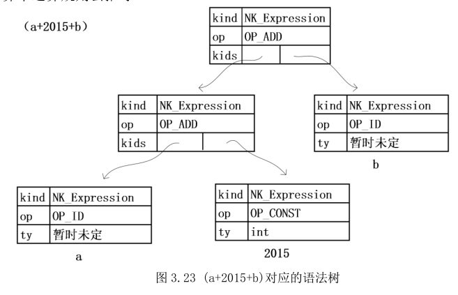
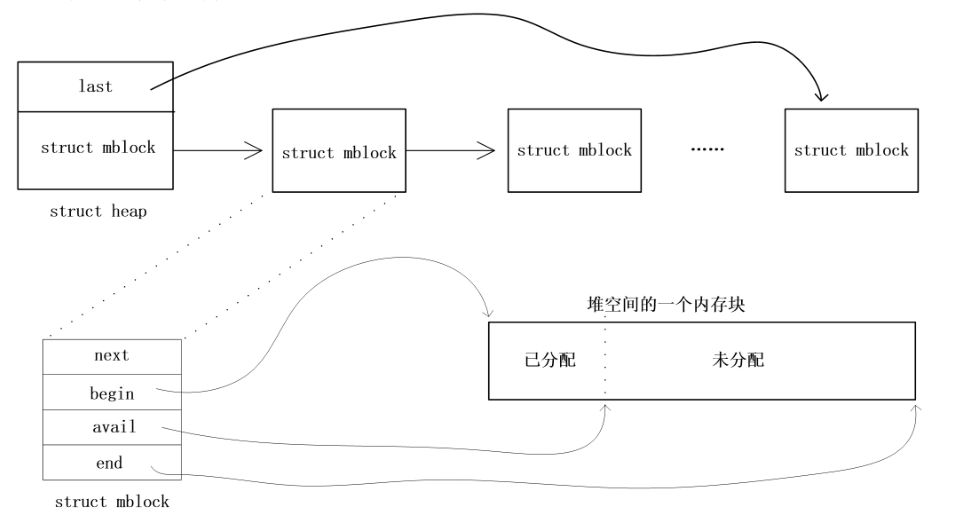

编译器、操作系统、数据库是计算机领域中的三大基础软件，基本上所有应用软件都是建立在这三个基础软件之上，这些领域经过前辈们不断打磨现在已经变得非常成熟，很多涉及到的代码技术都是精华中的精华，所以把上面3个软件搞清楚对代码水平的提高会有很多帮助，而且能够对现代计算机的软件架构有更清晰的了解。

我现在要研究一个逻辑推理系统，这个推理系统以C语言为基础，这里必然涉及到C语言的解析问题，所以C语言编译器是必须要先学习的，C语言编译器是把C语言转换成汇编语言，我打算在编译器的基础上生成一些关于逻辑的断言，然后以这些逻辑断言为基础再做一个推理系统。

目前C语言编译器比较成熟的是gcc、clang加llvm，但是这些都太庞大了，这里面有各种技术优化上的考量，个人是没有精力也没有时间掌握的。我需要学习的是编译器的一些基本思想，所以只要看一些小型的开源C语言编译器就可以了，其实还是挺多的，有lcc、ucc、tcc、8cc等等。

我现在打算从ucc入手学编译器，这是国人写的，可读性方面做的比较好，还有大佬对ucc做了非常详细的解析，见
https://blog.csdn.net/sheisc/article/category/2813001
而且还写了一本书叫《c编译器剖析》，对于我来说要以最快的速度学完编译器的一些基本知识，ucc相对来说是一个比较好的选择。

# 1.基本架构
其实ucc编译器并不是一个完整的编译器，完整的编译器包括预处理器、C编译器、汇编器和连接器，ucc只有把C语言编译成汇编语言的这一部分，如下图所示：     
     
打开ucc的源码，可以看到包含ucc和ucl两部分工程，因为ucc编译器中只做了.i文件生成.s文件的工作，在ucl的代码中完成，所以为了从.c文件生成可执行文件还要在ucc中调用gcc的预处理器、汇编器和连接器的命令来完成整个编译的过程。

现在假如要编译一个test.c文件，可以先运行命令ucc -E -v test.c来生成预处理后的文件test.i,然后再运行ucl -ext:.s test.i来调试分析整个编译的过程。

# 2.词法分析
现在从ucl.c文件中的main函数来分析整个编译的流程，代码如下

```c
	i = ParseCommandLine(argc, argv);

	SetupRegisters();
	SetupLexer();
	SetupTypeSystem();
	for (; i < argc; ++i)
	{
        Compile(argv[i]);
	}
```
首先是寄存器和词法分析器的相关初始化，然后通过for循环由Compile编译每一个.c文件。

之后由ParseTranslationUnit()来完成词法分析和语法分析工作，首先读取整个文件，放在Input的全局变量里，这是一个struct input结构体类型的变量，定义如下：

```c
struct input
{
    //文件名，预处理后会把所有.h文件展开到.i文件
    //例如 # 667 "/usr/include/stdio.h" 3 4
    //会记录头文件名和对应行数
    char *filename;
    unsigned char *base;//整个文件
    //当前解析到的单词的下一个地址
    //例如 int aa[4]; 
    //如果现在解析了aa，那么cursor指向[4];
    unsigned char *cursor;
    unsigned char *lineHead;//每一条语句以;为单位
    int line;// 当前在.i文件中的行数
    void* file;//文件描述符
    void* fileMapping;
    unsigned long size;//文件大小
};
```
另外还一个TokenCoord全局变量是Input的补充，增加了头文件中的行数。在C语言中是以单词为单位的，上面代码的注释中用int aa[4];举了一个例子，这条语句的单词分别为int、aa、[、]、4、; 。ucc会用NEXT_TOKEN取得一个单词放在CurrentToken里，然后再进行语法分析：
```c
#define NEXT_TOKEN  CurrentToken = GetNextToken();
```

CurrentToken是一个枚举型变量，代表一个单词的属性，并不是每个单词字符串本身，每个关键字都会有一个对应的枚举变量，下面是所有token的定义：

```c
enum token
{
    TK_BEGIN,
#define TOKEN(k, s) k,
#include "token.h"
#undef  TOKEN
};
//keywords
TOKEN(TK_AUTO,      "auto")
TOKEN(TK_EXTERN,    "extern")
TOKEN(TK_REGISTER,  "register")
TOKEN(TK_STATIC,    "static")
TOKEN(TK_TYPEDEF,   "typedef")
... ...
```

C语言中定义的标识符Token统一用TK_ID来表示，在取得一个单词的Token后会添加到语法树的结点里。

# 3.语法分析

词法分析从C源文件中取得单词的token，而语法分析则把这些单词添加到语法树里面。AstNode是语法树结点最基本的结构体：

```c
#define AST_NODE_COMMON   \
    int kind;             \
    struct astNode *next; \
    struct coord coord;

typedef struct astNode
{
	AST_NODE_COMMON
} *AstNode;
```
其中kind代表结点的类型。next用来把同类的表达式关联在一起，例如用;和，隔开的语句。coord则标记所在文件和与其对应的行数。其他类型的结点由于kind不同所需要的信息不同，结构体会有所差异，但都是在AstNode的基础上扩充而来的。

在语法分析的过程中，首先会先建立一个NK_TranslationUnit类型的根结点，该结点定义如下
```c
struct astTranslationUnit
{
	AST_NODE_COMMON
	AstNode extDecls;
};
```
这个根结点把一个.c文件中每一条全局声明语句和函数串联在一起，如下图所示可以直观感受到语法树的特点       
      
代码如下：

```c
AstTranslationUnit ParseTranslationUnit(char *filename)
{
    AstTranslationUnit transUnit;
    AstNode *tail;

    //...

    while (CurrentToken != TK_END)
    {
        *tail = ParseExternalDeclaration();
        tail = &(*tail)->next;
        SkipTo(FIRST_ExternalDeclaration,
                "the beginning of external declaration");
    }
}
```

每个结点可以分为声明语句和表达式两种类型，表达式又由赋值和运算语句组成。以下面的代码举例说明

```c
extern int c；
int test(int a)
{	
    int b = 1;
    a = b+sizeof(int);
    if(a>0){
    	c++;
    }
	return 0;
}
```
其中声明语句有
>extern int c； 
int test(int a){}  
 int b = 1；

表达式语句有
>    a = b+sizeof(int);
    if(a>0){
    	c++;
    }
	return 0;

根据这2种类型的结点会再建立子语法树，层层递归直到语法树结点中的元素为单词为此。
## 3.1 声明语句
声明语句的解析会在ParseCommonHeader()函数中完成，ParseDeclarationSpecifiers()函数会解析声明关键字如int、static、typedef等，声明中的标识符由ParseInitDeclarator()来解析，碰到逗号通过next指针连接在一起。

```c
while (CurrentToken == TK_COMMA)
{
    NEXT_TOKEN;
    *tail = (AstNode)ParseInitDeclarator();
    tail = &(*tail)->next;
}
```
声明的语句中可能会初始化如int a = 3；在解析完后再把=后面的语句加入到语法树中

```c
static AstInitDeclarator ParseInitDeclarator(void)
{
    AstInitDeclarator initDec;

    CREATE_AST_NODE(initDec, InitDeclarator);

    initDec->dec = ParseDeclarator(DEC_CONCRETE);
    if (CurrentToken == TK_ASSIGN)//遇到=说明要初始化
    {
        NEXT_TOKEN;
        initDec->init = ParseInitializer();
    }

    return initDec;
}
```
ParseDeclarator解析具体的声明标识符，后面的参数DEC_CONCRETE说明标识符不可省略，有些地方的声明语句不能有标识符，如sizeof（int）,这时候用DEC_ABSTRACT，还有些地方可有可无，如声明函数的时候int f(int,int); ,这时候调用ParseDeclarator(DEC_CONCRETE|DEC_ABSTRACT);

声明符中可能会碰到指针的情况，*会作为一个单独的语法树结点解析

```c
static AstDeclarator ParseDeclarator(int kind)
{
    if (CurrentToken == TK_MUL) //指针声明符*
    {
        AstPointerDeclarator ptrDec;

        CREATE_AST_NODE(ptrDec, PointerDeclarator);

        //...

        //递归调用继续解析
        ptrDec->dec = ParseDeclarator(kind);

        return (AstDeclarator) ptrDec;
    }
    //继续解析非指针情形下的声明标识符
    return ParsePostfixDeclarator(kind);
}
```
在ParsePostfixDeclarator()函数中会调用ParseDirectDeclarator()解析最后的标识符单词，标识符后面跟着[]是数组，跟着()是函数形参，还需要继续解析。

当声明语句中碰到typedef时，会通过CheckTypedefName()函数将声明的标识符加入到TDName列表中记录下来。然后遇到TK_ID的标识符时，会通过IsTypedefName()确认之前有没有通过typedef声明过。在C语言中每个{}代表一个作用域，ucc中用Level标记当前的作用域，作用域每加深一层Level 加1。有时碰到内部作用域定义的变量和外部typedef声明的标识符重名了，需要加到OverloadNames列表中重载。

最后通过一张图来直观感受一下声明语句的解析过程，图片取自《C编译器剖析》    
     

## 3.2 表达式语句

表达式语句只存在于函数中，在ParseCommonHeader()解析完声明语句后，会检查声明的标识符是否是函数，如果是函数则进一步解析由{}扩起来的符合语句，在ParseCompoundStatement()中完成，函数内部也分为声明语句和表达式语句，分别由ParseDeclaration()和ParseStatement()这两个函数完成。

表达式语句的组成有很多，如赋值语句，if语句，while语句等等，根据当前不同的token来对应解析：

```c
static AstStatement ParseStatement(void)
{
    switch (CurrentToken)
    {
    case TK_ID:
        return ParseLabelStatement();

    case TK_IF:
        return ParseIfStatement();

    case TK_SWITCH:
        return ParseSwitchStatement();

    case TK_WHILE:
        return ParseWhileStatement();

    case TK_DO:
        return ParseDoStatement();

    case TK_FOR:
        return ParseForStatement();

    case TK_GOTO:
        return ParseGotoStatement();

        //...

    default:
        return ParseExpressionStatement();
    }
}
```
表达式的结点由struct astExpression结构体定义

```c
struct astExpression
{
    AST_NODE_COMMON
    Type ty;
    int op :16;//表达式对应的操作符
    int isarray :1;
    int isfunc :1;
    int lvalue :1;
    int bitfld :1;
    int inreg :1;
    int unused :11;
    //记录2元表达式的前后2个子表达式
    struct astExpression *kids[2];
    union value val;
};
```

在碰到非关键字的标识符后会先通过ParseLabelStatement()查看是否是标签语句（例如error：），如果不是那么通过ParseExpressionStatement()来继续解析。首先解析赋值语句，碰到逗号继续递归调用，把下一个表达式连接在comaExpr->kids[1]里

```c
AstExpression ParseExpression(void)
{
    AstExpression expr, comaExpr;

    expr = ParseAssignmentExpression();
    while (CurrentToken == TK_COMMA)
    {
        CREATE_AST_NODE(comaExpr, Expression);

        comaExpr->op = OP_COMMA;
        comaExpr->kids[0] = expr;
        NEXT_TOKEN;
        comaExpr->kids[1] = ParseAssignmentExpression();

        expr = comaExpr;
    }

    return expr;
}
```

ucc会认为所有的表示式语句都是赋值表达式，如果有赋值符号= *= /= %= += -= <<= >>= &= ^= |=则当成赋值表达式处理，或者没有赋值号当成条件表达式处理。

```c
AstExpression ParseAssignmentExpression(void)
{
    AstExpression expr;

    expr = ParseConditionalExpression();
    if (CurrentToken >= TK_ASSIGN && CurrentToken <= TK_MOD_ASSIGN)
    {
        //...
    }

    return expr;
}
```
赋值号左边的表达式都会当成条件表达式，条件表达式由2元表达式和？组成，没有？则当成2元表达式处理

```c
static AstExpression ParseConditionalExpression(void)
{
    AstExpression expr;

    expr = ParseBinaryExpression(Prec[OP_OR]);
    if (CurrentToken == TK_QUESTION)
    {
        //...
    }

    return expr;
}
```
依次类推，2元表达式由一元表达式和2元运算符组成，一元表达式由ParseUnaryExpression()来解析，1元表达式由前置一元运算符（++ -- & * + - ! ~）和没有前置运算符的一元表达式组成，后者由ParsePostfixExpression()来解析,此时没有后缀的表达式由ParsePrimaryExpression()来解析，如果还有后缀.、->、--、++等还要再新建一个结点把前面解析的表示符合后缀连起来。碰到括号等情况会继续递归解析，就不再详细分析了。还要注意的是++运算符在前置和后置时的表示是不同的，前者用OP_PREINC表示后者用OP_POSTINC表示。

在解析2元表达式时，还要注意优先级问题，例如a<<5+3,在解析到5+3时，由于+的优先级比<<高，所以5+3要作为一个整体，而在表达式a*b+3中，+优先级没有\*高，b要先作为\*的右端开始解析然后再解析+号。

```c
static AstExpression ParseBinaryExpression(int prec)
{
    AstExpression binExpr;
    AstExpression expr;
    int newPrec;

    expr = ParseUnaryExpression();
    /// while the following binary operater's precedence is higher than current
    /// binary operator's precedence, parses a higer precedence expression
    while (IsBinaryOP(CurrentToken) && (newPrec = Prec[BINARY_OP]) >= prec)
    {
        CREATE_AST_NODE(binExpr, Expression);

        binExpr->op = BINARY_OP;
        binExpr->kids[0] = expr;
        NEXT_TOKEN;
        binExpr->kids[1] = ParseBinaryExpression(newPrec + 1);

        expr = binExpr;
    }

    return expr;

}
```
最后仍然根据语法树的图片来直观感受下解析的过程，图片取自《C编译器剖析》    
      
     

# 内存分配

最后讲一下内存分配，在ucc编译器中会把内存的分配放在自建的一个堆里进行管理。程序里总共有3个堆，分别为：

 - ProgramHeap
 用来初始化寄存器的管理和基本的类型系统。
 - FileHeap
 为每个C文件构建语法树和符号表用。
 - StringHeap
 存放C文件中字符串和标志符的名称。

每个堆是由一个头部节点和内存节点组成的链表，头部节点不分配内存，并分别指向下一个节点和链表最后一个节点，整体结构如下图所示：     

          

分配内存时由HeapAllocate函数来完成，每一次申请内存时都会新建一个节点并分配相应的空间，在解析完一个文件后，FileHeap堆会重新初始化，堆里的内存并不会释放，而由FreeBlocks指向第2个结点，再次申请内存时会先从FreeBlocks查找有没有足够空间的结点。这里似乎有问题，如果一开始申请一块比较大的空间，让FreeBlocks移到了后面，然后FreeBlocks并没有跳回到前面，导致前面的空间都浪费了。
