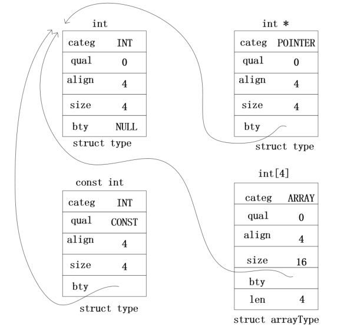
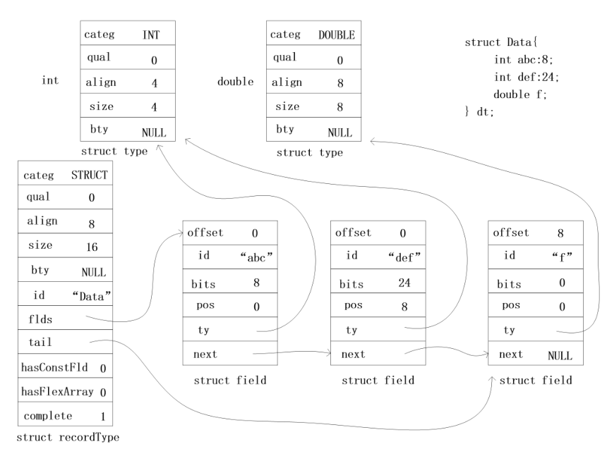
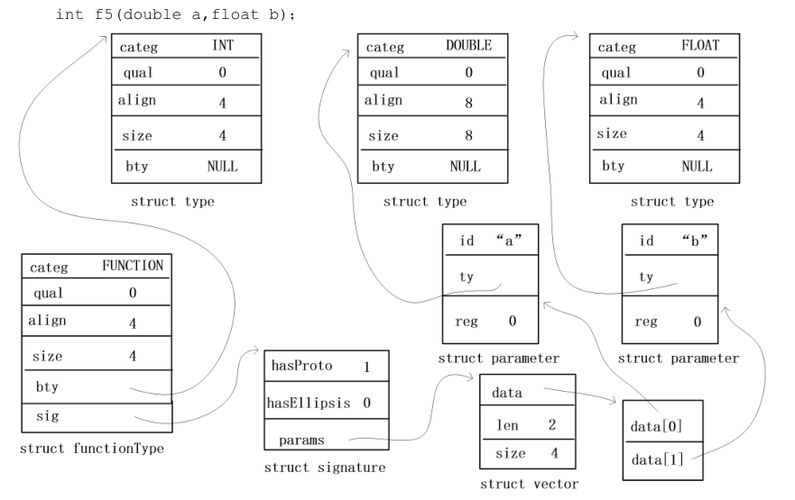
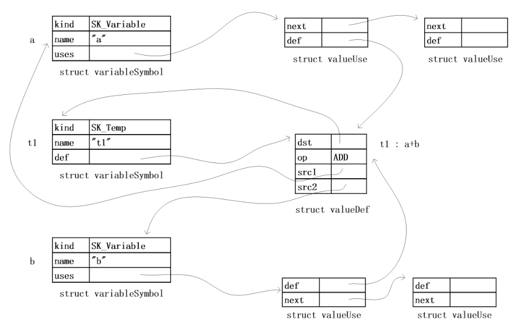
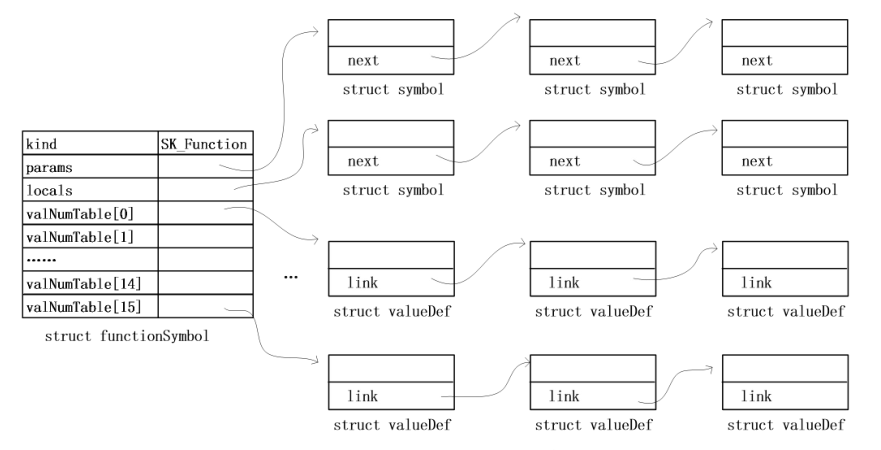
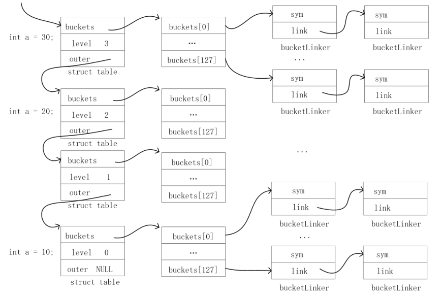

ucc编译器分析与总结(2) 类型系统和符号管理

在语法分析的过程中，ucc按照C语言的文法构建了一颗语法树，接下来要根据语法树来进行语义检查，判断代码是否存在编译错误，譬如表达式中的变量有没有定义，定义数组的长度是否为常量，表达式中的类型是否合法等等。

语义检查分为语句表达式检查和声明检查两部分，在分析声明检查之前，需要先了解ucc的类型构建，在这个过程中会为声明的变量构建了一个类型系统，同时对出现标识符进行管理。

# 1 类型系统
## 1.1 基本类型

首先定义一些最基本的类型，在SetupTypeSystem()函数中初始化,类型结构体如下

```c
#define TYPE_COMMON \
    int categ : 8;  \
    int qual  : 8;  \
    int align : 16; \
    int size;       \
    struct type *bty;
	
typedef struct type
{
    TYPE_COMMON
} *Type;
```
有了基本类型之后，就可以通过类型的复合组成新的类型，其中bty指向的是子类型，如下图所示指针和int的组合，数组和int的组合     
   
## 1.2 结构体类型

结构体类型需要对基本类型进行扩充从而能够表示结构体的成员和位域，从下面这张图可以清晰的看到结构体类型struct recordType和成员变量、位域以及基本类型的关系     
     
成员变量和位域的表达方式是相同的，都是struct field类型，只不过成员变量的pos始终为0，成员之间用链表连接在一起，并且都指向一个声明的类型。

## 1.3 函数类型

在函数的类型结构中，bty成员为返回值的类型，另外增加了一个sig成员来记录相关函数信息，其中sig.hasProto表示是否使用新式函数声明风格，比如int f(a,b)int a in b{}是属于老式风格，sig.hasEllipsis表示不定参数，比如f(...), 最后sig.params为一个向量列表用来存储函数形参，具体的直观结构见下图：  
    
# 2 符号管理

在C语言中声明了各种标识符，需要对这些符号分类并统一管理。每个符号是一个struct symbol结构体类型，里面定义了符号的相关信息。

符号类型总共12种，有些类型直接用struct symbol就可以记录相关信息，还有些类型需要增加额外的成员记录更多信息。对于一个变量来说，就需要更多的信息来记录公共子表达式，例如

```
c = a+b;
d =a+b;
```
这里的a+b是公共子表达式，c = a+b算了之后a和b的值并没有改变，所以不必重新计算，直接查表就可以了，变量的结构体定义如下

```c
typedef struct variableSymbol
{
    SYMBOL_COMMON
    InitData idata;
    ValueDef def;
    ValueUse uses;
    int offset;
} *VariableSymbol;
```
下面这张图可以看出变量和公共子表达式的关系    

     
函数的符号结构也需要在基本的符号结构上进行扩充，其中params记录形参符号的单向链表，locals记录局部变量的单向链表，另外还有一个hash表记录各种公共子表达式用来快速查询，哈希表如下图所示     
       
接下来的问题是如何存储这些符号，这里ucc专门定义了struct table类型的全局变量来存放，定义如下

```c
typedef struct table
{
    Symbol *buckets;
	int level;
	struct table *outer;
} *Table;

// tags in global scope, tag means struct/union, enumeration name
static struct table GlobalTags;
// normal identifiers in global scope
static struct table GlobalIDs;
// all the constants
static struct table Constants;
// tags in current scope
static Table Tags;
// normal identifiers in current scope
static Table Identifiers;
```
其中Tags存放的是结构体符合，Identifiers存放的是其他符号，在C语言中每一个{}都是一个新的域，不同的域中的符号是相互不可见的，所以每个域中都管理着各种的符号GlobalTags和GlobalIDs代表的是全局符号。每次进入和离开一个域都会调用EnterScope和ExitScope，然后改变Identifiers->outer和Tags->outer指向的域，buckets是一个hash表，key值相同的符号会再组成一个链表，对于如下代码

```c
// 深度 level is 0
int a = 10;
int main(int argc, char * argv[])
{ // level is 1
    { // level is 2
        int a = 20;
        int b[10] =
        { 1, 2 };
        { // level is 3
            int a = 30;
            a = 40;
        }
        a = 50;
    }
    a = 60;
    return 0;
}
```
符号a在不同位域中的存储如下    
     
