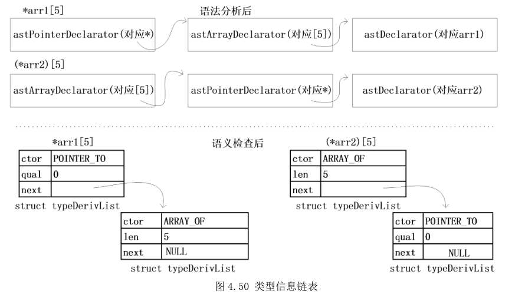
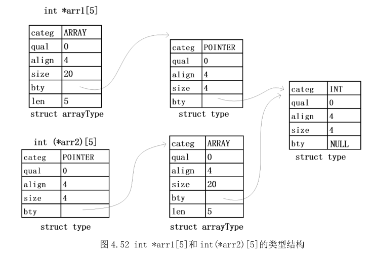

ucc编译器分析与总结(3) 声明检查

有了类型系统和符号管理的基础知识之后，接下来就可以分析声明检查部分的代码了。

源代码经过预编译后生成.i文件，这时候代码主要分为函数语句和声明语句两部分，其实函数只不过是一种特殊的声明语句，比声明语句多了{}里面的内容。函数语句和非函数语句是分开检查的：

```c
if (p->kind == NK_Function)
{
    CheckFunction((AstFunction)p);
}
else
{
    assert(p->kind == NK_Declaration);
    CheckGlobalDeclaration((AstDeclaration)p);
}
```

下面先来分析全局定义的声明检查，也就是CheckGlobalDeclaration()函数里的内容。

# 1 基本类型检查
一开始调用CheckDeclarationSpecifiers(decl->specs)进行声明类型的检查，除了类型检查外还会检查一些修饰符如const、static等等。检查之后得到的类型将会赋值给specs->ty,如果有修饰词还需要再组合成一个新的类型，基本代码如下

```c
static void CheckDeclarationSpecifiers(AstSpecifiers specs)
{
    ... ...
    //storage-class-specifier:      extern  , auto, static, register, ... 
    tok = (AstToken) specs->stgClasses;
    if (tok)
    {
        ...
        specs->sclass = tok->token;
    }
    //type-qualifier:   const, volatile
    tok = (AstToken) specs->tyQuals;
    while (tok)
    {
        qual |= (tok->token == TK_CONST ? CONST : VOLATILE);
        tok = (AstToken) tok->next;
    }
    //type-specifier:   int,double, struct ..., union ..., ...
    p = specs->tySpecs;
    while (p)
    {
        //结构体类型
        if (p->kind == NK_StructSpecifier || p->kind == NK_UnionSpecifier)
        {
            ty = CheckStructOrUnionSpecifier((AstStructSpecifier) p);
            tyCnt++;
        }
        else if (p->kind == NK_EnumSpecifier)//枚举类型
        {
            ty = CheckEnumSpecifier((AstEnumSpecifier) p);
            tyCnt++;
        }
        else if (p->kind == NK_TypedefName)//typedef重定义类型
        {
            ...
        }
        else
        {
            //基本类型
            tok = (AstToken) p;

            switch (tok->token)
            {
            case TK_SIGNED:
            case TK_UNSIGNED:
                sign = tok->token;
                signCnt++;
                break;

            case TK_SHORT:
            case TK_LONG:
                if (size == TK_LONG && sizeCnt == 1)
                {
                    size = TK_LONG + TK_LONG;
                }
                else
                {
                    size = tok->token;
                    sizeCnt++;
                }
                break;

            case TK_CHAR:
                ty = T(CHAR);
                tyCnt++;
                break;

            case TK_INT:
                ty = T(INT);
                tyCnt++;
                break;

            ...
            }
        }
        p = p->next;
    }
    ...

    //组合修饰符类型并返回
    specs->ty = Qualify(qual, ty);
    return;
}
```
# 2 结构体类型检查

碰到结构体类型时，会在CheckStructOrUnionSpecifier()函数中继续深入处理，结构体有4种类型，分别是

 1.  struct Data1 // 有结构体名但无“大括号”
 2. struct {int a; int b;} // 无结构体名但有“大括号”
3. struct Data2{int a; int b;} // 有结构体名也有“大括号”
4. struct // 无结构体名也无“大括号” ，语法分析时已报错

如果结构体有名字，那么会先检查符号表中是否已经保存了该名字，如果没有，那么新建一个结构体类型并保存到符号表中，代码如下

```c
tag = LookupTag(stSpec->id);
if (tag == NULL)
{
    ty = StartRecord(stSpec->id, categ);
    tag = AddTag(stSpec->id, ty,&stSpec->coord);
}
else if (tag->ty->categ != categ)
{
    Error(&stSpec->coord, "Inconsistent tag declaration.");
}
```
接下来会对结构体的成员变量逐一进行声明检查

```c
	while (stDecl)
	{
        CheckStructDeclaration(stDecl, ty);
        stDecl = (AstStructDeclaration)stDecl->next;
	}
```
和普通声明语句的检查类似，先检查声明类型，再检查声明标识符

```c
CheckDeclarationSpecifiers(stDecl->specs);
...
/**
 struct Data{
 int c, d;           
 }
 */
while (stDec)
{
    //结构体类型，成员变量，成员类型
    CheckStructDeclarator(rty, stDec, stDecl->specs->ty);
    stDec = (AstStructDeclarator)stDec->next;
}
```
成员标识符的检查和全局标识符的检查类似，都是调用CheckDeclarator()和DeriveType()来完成复合类型的构建，这个将在后面分析，每个成员类型构建完毕后会调用AddField()把成员插入到结构体类型的位域链表里，见上一篇文章的1.2节，相关代码如下：

```c
static void CheckStructDeclarator(Type rty, AstStructDeclarator stDec, Type fty)
{
    char *id = NULL;
    int bits = 0;

    // 如果空，可能出现位域中没有名字的情况，例如int :4;
    if (stDec->dec != NULL)
    {
        CheckDeclarator(stDec->dec);
        id = stDec->dec->id;
        fty = DeriveType(stDec->dec->tyDrvList, fty, &stDec->coord);
    }

    //...

    AddField(rty, id, fty, bits);
}

```
# 3 声明标识符的检查

这个由递归调用CheckDeclarator()函数来完成，在构建语法树时可能会将基本标识符合数组指针等类型复合在一起，所以最后碰到NK_NameDeclarator结点终止递归，代码如下

```c
static void CheckDeclarator(AstDeclarator dec)
{
    switch (dec->kind)
    {
    case NK_NameDeclarator:
        break;

    case NK_ArrayDeclarator:
        CheckArrayDeclarator((AstArrayDeclarator) dec);
        break;

    case NK_FunctionDeclarator:
        CheckFunctionDeclarator((AstFunctionDeclarator) dec);
        break;

    case NK_PointerDeclarator:
        CheckPointerDeclarator((AstPointerDeclarator) dec);
        break;

    default:
        assert(0);
    }
}
```
这里以数组为例，先递归调用CheckDeclarator()检查子结点，检查完毕后再检查数组长度，最后把该结点插入到tyDrvList链表的头部，代码如下

```c
//  int arr[4];
static void CheckArrayDeclarator(AstArrayDeclarator arrDec)
{
    CheckDeclarator(arrDec->dec);
    /**
     struct Data{
     ....
     int a[];    ----> legal.    when  arrDec->expr is NULL.
     }
     */
    if (arrDec->expr)
    {
        if ((arrDec->expr = CheckConstantExpression(arrDec->expr)) == NULL)
        {
            Error(&arrDec->coord,
                    "The size of the array must be integer constant.");
        }
    }

    ALLOC(arrDec->tyDrvList);
    arrDec->tyDrvList->ctor = ARRAY_OF;
    arrDec->tyDrvList->len = arrDec->expr ? arrDec->expr->val.i[0] : 0;
    arrDec->tyDrvList->next = arrDec->dec->tyDrvList;
    arrDec->id = arrDec->dec->id;
}
```
指针结点和函数结点也是类似的，下图说明了int *arr1[5]和int (*arr2)[5]的解析过程     
    
在构建了tyDrvList链表之后，DeriveType()函数会遍历tyDrvList链表并与声明类型组合成一个复合类型，基类指向声明类型如下图所示       
     
在构建完类型后，会检查符号表中有没有该标识符，如果没有则把标识符名称和类型一起添加到符号表中

```c
/**
 Check for global variables
 */
if ((sym = LookupID(initDec->dec->id)) == NULL)
{
    sym = AddVariable(initDec->dec->id, ty, sclass,&initDec->coord);
}
```

再来看函数的语义检查，在CheckFunction()实现，类似的也要检查函数声明类型（返回类型），标识符（函数名），通过DeriveType()组合成复合类型添加到函数符号表里，之前在CheckFunctionDeclarator()函数里已经把函数参数放到了((FunctionType)ty)->sig->params向量里，然后通过AddVariable()把函数形参列表添加到符号表。声明检查完毕后接下来要检查函数语句是否合法，通过调用CheckCompoundStatement(func->stmt)来完成，这个将在下一篇文章中详细分析。
