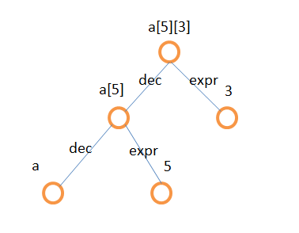
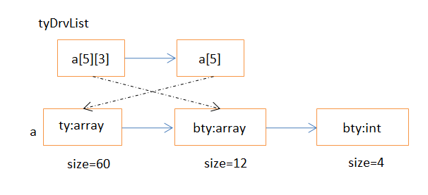
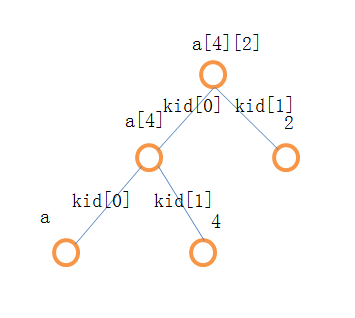

ucc编译器分析与总结(4)表达式和语句检查

# 1.基本框架

之前在语法分析时建立了抽象语法树，在声明时为每个符号建立了类型系统，接下来就要遍历表达式和语句的每个结点，将这些声明的类型绑定在对应的结点，并相应的进行语义规范的检查。

每个复合语句的检查都以一个大括号为单位，在这里面又分为局部变量声明的检查和执行语句的检查

```c
AstStatement CheckCompoundStatement(AstStatement stmt)
{
    AstCompoundStatement compStmt = AsComp(stmt);
    AstNode p;

    compStmt->ilocals = CreateVector(1);
    p = compStmt->decls;
    while (p)
    {
        CheckLocalDeclaration((AstDeclaration) p, compStmt->ilocals);
        p = p->next;
    }
    p = compStmt->stmts;
    while (p)
    {
        CheckStatement((AstStatement) p);
        p = p->next;
    }

    return stmt;
}
```
CheckStatement中根据表达式的类型stmt->kind来确定检查普通表达式还是带有关键字的语句

```c
static AstStatement (*StmtCheckers[])( AstStatement) =
{
    CheckExpressionStatement, // the index is (NK_ExpressionStatement - NK_ExpressionStatement), 0
        CheckLabelStatement,// the index is ( NK_LabelStatement - NK_ExpressionStatement), 1
        CheckCaseStatement,// 2
        CheckDefaultStatement,// 3
        CheckIfStatement,// 4
        CheckSwitchStatement,// 5
        CheckLoopStatement,
        CheckLoopStatement,
        CheckForStatement,
        CheckGotoStatement,
        CheckBreakStatement,
        CheckContinueStatement,
        CheckReturnStatement,
        CheckLocalCompound
};

static AstStatement CheckStatement(AstStatement stmt)
{
    return (*StmtCheckers[stmt->kind - NK_ExpressionStatement])(stmt);
}
```

CheckExpressionStatement中又会调用CheckExpression，基本上所有的表达式检查都要从这里进入，根据表达式的运算符来确定检查类型，是赋值运算还是双目运算表达式还是单目运算表达式

```c
AstExpression CheckExpression(AstExpression expr)
{
    return (* ExprCheckers[expr->op])(expr);
}
```

如果是双目运算表达式，那么递归检查运算符的左边表达式和右边表达式，最后根据运算符类型再进一步确定检查类型

```c
static AstExpression (*BinaryOPCheckers[])( AstExpression) =
{
    CheckLogicalOP, // "||"
        CheckLogicalOP,// "&&"
        CheckBitwiseOP,// |
        CheckBitwiseOP,// ^
        CheckBitwiseOP,// &
        CheckEqualityOP,// ==
        CheckEqualityOP,// !=
        CheckRelationalOP,// >
        CheckRelationalOP,// <
        CheckRelationalOP,// >=
        CheckRelationalOP,// <=
        CheckShiftOP,//  <<
        CheckShiftOP,// >>
        CheckAddOP,// +
        CheckSubOP,// -
        CheckMultiplicativeOP,// *
        CheckMultiplicativeOP,//  /
        CheckMultiplicativeOP// %
};

static AstExpression CheckBinaryExpression(AstExpression expr)
{

    expr->kids[0] = Adjust(CheckExpression(expr->kids[0]), 1);
    expr->kids[1] = Adjust(CheckExpression(expr->kids[1]), 1);
    return (*BinaryOPCheckers[expr->op - OP_OR])(expr);
}
```

其他类型的表达式检查也是类似，都是对expr->kids[0]和expr->kids[1]进行递归，最后到达只有一个符号的原子表达式，然后调用CheckPrimaryExpression检查符号表确定该表达式类型。

对于if、while等关键字语句，会先检查小括号内对应的判断表达式，然后再对接下来的执行语句体进行递归检查，如下代码是对while语句的检查

```c
static AstStatement ParseWhileStatement(void)
{
    AstLoopStatement whileStmt;

    CREATE_AST_NODE(whileStmt, WhileStatement);

    NEXT_TOKEN;
    Expect(TK_LPAREN);
    whileStmt->expr = ParseExpression();
    Expect(TK_RPAREN);
    whileStmt->stmt = ParseStatement();

    return (AstStatement) whileStmt;
}
```
# 2.语义检查
由于接下来的内容太细碎了，不再逐一分析，只举一些典型的例子具体分析。
## 2.1 变量未定义
在CheckPrimaryExpression()函数中检查符号表时会检查到

```c
    p = LookupID(expr->val.p);
	if (p == NULL)
	{
        Error(&expr->coord, "Undeclared identifier: %s", expr->val.p);
	}
```
## 2.2 结构体成员的偏移地址

```c
typedef struct aa{
    char a;
    int b;
}AA;
int a[sizeof(AA)+(int)(&((AA*)0)->b)] = {0};
```
对于这样的代码ucc编译器是通不过的，会报出数组长度不是常量的错误

```c
if (arrDec->expr)
{
    if ((arrDec->expr = CheckConstantExpression(arrDec->expr)) == NULL)
    {
        Error(&arrDec->coord, "The size of the array must be integer constant.");
    }
}
```
事实上这是可以通过编译的，(int)(&((AA*)0)->b)是一个常量，ucc并没有对其计算，稍微改造一下就可以了，在指针运算符检查时，先判断其对应的结构体是否是0常量，如果是就将整个表达式转为该成员偏移地址的常量

```c
if( expr->kids[0]->op == OP_CONST &&
        expr->kids[0]->val.i[0]==0 &&
        expr->op==OP_PTR_MEMBER )
{
    expr->val.i[0] = fld->offset;
    expr->op = OP_CONST;
}
else
{
    expr->val.p = fld;
}
```
同时在CheckUnaryExpression()函数中检查取地址表达式时，如果子表达式是常量，该表达式也要从取地址表达式转换为常量表达式

```c
if( expr->kids[0]->op == OP_CONST )
{
    expr->op = OP_CONST;
    expr->val.i[0] = expr->kids[0]->val.i[0];
}
```

## 2.3 二维数组

这里以int a[5][3],调用时a[4][2] = 1为例，一开始解析声明时会得到如下二叉树     
     
在声明的语义检查后会生成一个tyDrvList链表，继而产生符号a的类型：
      
a[4][2] 会在表达式中解析，语法树如下     
      
在表达式的类型检查中，调用CheckExpression()递归，会到a结点结束，最后获得一个二维数组的类型，类型长度为60，当检查到kid[1]是整数是，把a[4]结点设为a类型的子类型即`expr->ty = expr->kids[0]->ty->bty;` 依次类推，a[4][2]的类型是一个int整型

现在再来看Adjust函数

```c
AstExpression Adjust(AstExpression expr, int rvalue)
{
    int qual = 0;
    if (rvalue)
    {
        qual = expr->ty->qual;
        expr->ty = Unqual(expr->ty);
        expr->lvalue = 0;
    }

if (expr->ty->categ == FUNCTION)
{
    ... ...
}
else if (expr->ty->categ == ARRAY)
{
    expr->ty = PointerTo(Qualify(qual,expr->ty->bty));
    expr->lvalue = 0;
    expr->isarray = 1;
}
```
在数组运算调用如下:

```c
case OP_INDEX:
    expr->kids[0] = Adjust(CheckExpression(expr->kids[0]), 1);
    expr->kids[1] = Adjust(CheckExpression(expr->kids[1]), 1);
```
在赋值运算时调用如下

```c
	expr->kids[0] = Adjust(CheckExpression(expr->kids[0]), 0);
	expr->kids[1] = Adjust(CheckExpression(expr->kids[1]), 1);

	if (! CanModify(expr->kids[0]))
	{
        Error(&expr->coord, "The left operand cannot be modified");
	}
```
如果类型是数组名，那么赋值检查时在Adjust()函数中会把左值清0，上图例子中a和a[4]都是数组名，所以如果被赋值会在CanModify中被检查出非法。而a[4][2]在检查后得到的是a[4]所属类型的子类型，为int类型，所以可以作为左值被赋值。但是如果数组声明中有限定符const，那么const会被添加到数组的子类型中，此时就不能做为左值了，因为 CanModify会检查出来：

```c
static int CanModify(AstExpression expr)
{	
	return (expr->lvalue && ! (expr->ty->qual & CONST) && 
	        (IsRecordType(expr->ty) ? ! ((RecordType)expr->ty)->hasConstFld : 1));
}
```
## 2.4 指针运算

指针运算有多种类型，但其本质上都是取子表达式的子类型，概括如下：

```c
ty = expr->kids[0]->ty;//子表达式的类型
expr->ty = ty->bty;//取子表达式的子类型
```
全部代码如下：

```c
static AstExpression CheckUnaryExpression(AstExpression expr)
{
    Type ty;

    switch (expr->op)
    {
    //...
    case OP_DEREF:  // *
        //PRINT_I_AM_HERE();
        expr->kids[0] = Adjust(CheckExpression(expr->kids[0]), 1);
        ty = expr->kids[0]->ty;
        if (expr->kids[0]->op == OP_ADDRESS)
        {
            //*&a ---------------->  a
            //子表达式是&a，子表达式的子类型是a
            expr->kids[0]->kids[0]->ty = ty->bty;
            return expr->kids[0]->kids[0];
        }
        else if (expr->kids[0]->op == OP_ADD
                && (ty->bty->categ == ARRAY || expr->kids[0]->kids[0]->isarray))

        {
            //*(arr+3)    --------->  arr[3]
            //子表达式是arr+3，是一个数组，子表达式的子类型是数组元素arr[3]的类型
            expr->kids[0]->op = OP_INDEX;
            expr->kids[0]->ty = ty->bty;
            expr->kids[0]->lvalue = 1;
            return expr->kids[0];
        }
        if (IsPtrType(ty))
        {
            expr->ty = ty->bty;
            //...
            expr->lvalue = 1;
            return expr;
        }
        break;
    }
}
```
这里略微有一个小问题，在如下代码的检测中

```c
    int *p;
    *(*(p+2)+3) = 1;
```
*(p+2)得到的是int类型，*(p+2)+3也是int类型，并没有子表达式，这时*(*(p+2)+3)的代码中会出现ty->bty->categ的情况直接导致内存崩溃，所以事先应该先检查原子类型。

取地址运算符&也是类似的，该运算符返回一个指针类型，这个指针类型指向子表达式的类型。