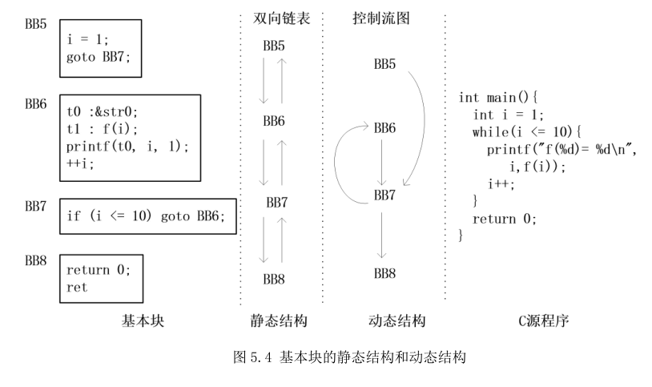
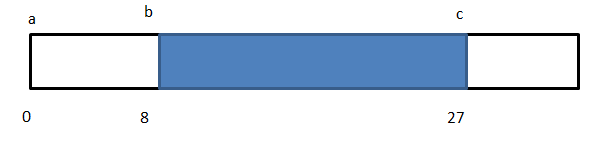

ucc编译器分析与总结(5) 中间代码生成

# 1.基本框架

经过语义检查后，现在已经有了包含符号和类型的完整语法树，现在要做的事情就是继续沿着语法树走一遍，对每条语句和表达式生成相应的中间代码。

中间代码以三地址码的形式表示，由两个源操作数，一个目的操作数和一个运算符组成。然后ucc在生成中间代码时以基本块为单位，每个基本块包含若干条中间代码，基本块的开头都会有类似BB1：这样的标签。

从静态上来看，所有基本块按顺序通过双向链表连接在一起，但从动态上来看，代码并非沿着基本块从上到下的执行，这里存在一些跳转，所以存在控制流转移的两个基本块间会生成一条有向边，一个结点可以有多条有向边对应多个源结点或目的结点，这样所有基本块和所有有向边就组成了一个控制流图，下图很直观地表达了基本块的静态结构和动态结构：     

   

现在再来看基本块的结构体

```c
struct bblock
{
    struct bblock *prev;
    struct bblock *next;
    Symbol sym;
    // successors
    CFGEdge succs;
    // predecessors
    CFGEdge preds;
    struct irinst insth;
    // number of instructions
    int ninst;
    // number of successors
    int nsucc;
    // number of predecessors
    int npred;
    int ref;
};
```
其中perv和next分别是基本块作为静态结构时，双向链表的前一个结点和后一个结点。insth存储的是中间代码，多条中间代码也是通过双向链表来连接的。succs和preds存储的是当前基本块在控制流图的后驱结点和前驱结点。控制流图的结构体如下：

```c
typedef struct cfgedge
{
    BBlock bb;
    struct cfgedge *next;
}*CFGEdge;
```

由于前驱结点和后驱结点不止一个，我们看到结构体中还有一个next成员把多个前驱结点或后驱结点串联在一起，现在来看一下生成有向边的代码：

```c
static void AddSuccessor(BBlock bb, BBlock s)
{
    CFGEdge e;

    ALLOC(e);
    e->bb = s;
    e->next = bb->succs;
    bb->succs = e;
    bb->nsucc++;
}

void DrawCFGEdge(BBlock head, BBlock tail)
{
    AddSuccessor(head, tail);
    AddPredecessor(tail, head);
}
```
现在要生成一条有向边，在head结点中添加后继结点，在tail结点中添加前驱结点。在AddSuccessor函数中先新建一条有向边，并把后继结点赋值给e->bb，然后当前结点可能有多个后继结点，通过e->next = bb->succs;把新的后继结点加入到链表，然后更改后继结点的链表表头，最后把后继结点的数量加一，AddPredecessor函数也是类似的。

解析时CurrentBB代表当前中间代码生成后存储的基本块，通过StartBBlock函数更改当前基本块。

# 2.表达式的中间代码

这部分内容很多而且繁琐，就不一一细说了，挑几个有代表性的地方说一下，对应的代码在tranexpr.c文件。

## 2.1 TranslatePrimaryExpression

函数最后返回expr->val.p，这是一个Symbol类型，由语义检查的函数CheckPrimaryExpression可知expr->val.p存储的确实是基本结点对应的符号。

## 2.2 位域的读写

先来看ReadBitField函数

```c
static Symbol ReadBitField(Field fld, Symbol p)
{
    int size = 8 * fld->ty->size;
    int lbits = size - (fld->bits + fld->pos);
    int rbits = size - (fld->bits);

    p = Simplify(T(INT), LSH, p, IntConstant(lbits));
    p = Simplify(GetBitFieldType(fld), RSH, p, IntConstant(rbits));

    return p;
}
```
现在要读如下结构体体中的位域b

```c
typedef struct aa{
    int a:8;
    int b:19;
    int c:5;
}AA;
```
整个结构体的内存分配如下图     
     
b对应的是蓝色区域，size为类型所占的bit数，lbits为c所占的bit数为5，rbits为a和c的总bit长度13，然后想要读取b的内容，先左移lbits位把c挤掉（要注意这里左移不是指图片中的方向），然后再右移rbits把b的起始地址移到开头。Simplify可以简单看做调用TryAddValue添加一条中间代码，只不过多了一些优化部分，TryAddValue还涉及到临时变量，将在后面分析。k = sad.b;生成的中间代码如下：

```c
	t22 : sad[0] << 5;
	t23 : t22 >> 13;
	k = t23;
```
现在来看写位域WriteBitField函数的代码，代码关键部分如下：

```c

static Symbol WriteBitField(Field fld, Symbol dst, Symbol src)
{
    int fmask = (1 << fld->bits) - 1;
    int mask = fmask << fld->pos;
    Symbol p;

    //... ...
    //源操作数左移8位
    src = Simplify(T(INT), LSH, src, IntConstant(fld->pos));
    //将所有非掩码区清0，即移位后的源操作数在蓝色部分清0
    src = Simplify(T(INT), BAND, src, IntConstant(mask));
    //将目的操作数在蓝色区域清0，生成一个临时变量
    p = Simplify(T(INT), BAND, dst, IntConstant(~mask));
    //将临时变量与源操作数或运算，相当于把源操作数的值放在蓝色区域
    p = Simplify(T(INT), BOR, p, src);
    //把临时变量p赋值给目的操作数
    GenerateMove(fld->ty, dst, p);

    //... ...
}
```
现在以代码sad.b = k;为例，生成的中间代码如下：

```c
	t16 : k << 8;
	t17 : t16 & 134217472;  这里是2^27-2^8
	t18 : sad[0] & -134217473;
	t19 : t18 | t17;
	sad[0] = t19;
```

## 2.3 临时变量

在符号的类型中专门定义了临时变量的类型，与之对应的是ValueDef结构体，存储了二元运算表达式中的源操作数和目的操作数，临时变量的用处是在源操作数没有更改时可以直接拿来用而不必再算一次，更多这部分内容的介绍可以看《C编译器剖析》的2.5节。

下面来解读TryAddValue的代码，详见注释

```c
Symbol TryAddValue(Type ty, int op, Symbol src1, Symbol src2)
{
    int h = ((unsigned)src1 + (unsigned)src2 + op) & 15;
    //通过hash表找到存储临时变量表达式的桶
    ValueDef def = FSYM->valNumTable[h];
    Symbol t;
 
    //查找该表达式是否存在对应的临时变量  
    while (def)
    {
        if (def->op == op && (def->src1 == src1 && def->src2 == src2))
            break;
        def = def->link;
    }
    //如果存在，就不必计算，直接用def->dst
    if (def && def->ownBB == CurrentBB && def->dst != NULL)
        return def->dst;

new_temp:
    //新建临时变量，生成赋值语句
    t = CreateTemp(ty);
    GenerateAssign(ty, t, op, src1, src2);
    //然后把临时变量的def记录到符号表里
    def = AsVar(t)->def;
    def->link = FSYM->valNumTable[h];
    FSYM->valNumTable[h] = def;
    return t;
}
```

## 2.4 短路运算

对于形如c = a||b或 c = a&&b的表达式并非对右边先求值，然后再赋值给左边，而是先计算a的值，如果这时已经能确定整个表达式的值，那么b就没有必要继续计算。代码的实现在TranslateBranchExpression函数里，源代码如下

```c
static Symbol TranslateBranchExpression(AstExpression expr)
{
    BBlock nextBB, trueBB, falseBB;
    Symbol t;

    t = CreateTemp(expr->ty);
    nextBB = CreateBBlock();
    trueBB = CreateBBlock();
    falseBB = CreateBBlock();

    TranslateBranch(expr, trueBB, falseBB);
    StartBBlock(falseBB);    
    GenerateMove(expr->ty, t, IntConstant(0));    
    GenerateJump(nextBB);
    StartBBlock(trueBB);
    GenerateMove(expr->ty, t, IntConstant(1));
    StartBBlock(nextBB);

    return t;
}

```

现在以k = k||2代码举例来说明，在生成赋值表达式TranslateAssignmentExpression的函数里解析 k||2时会调用TranslateBranchExpression函数，在TranslateBranch函数中会调用如下代码

```c
case OP_OR:
    rtestBB = CreateBBlock();
    //生成中间代码，如果k非0则生成跳往trueBB
    TranslateBranch(expr->kids[0], trueBB, rtestBB);
    //现在进入rtestBB基本块
    StartBBlock( rtestBB);
    //生成中间代码，如果2为非0，则跳向trueBB
    TranslateBranch(expr->kids[1], trueBB, falseBB);
    break;
default:
    src1 = TranslateExpression(expr);
    GenerateBranch(ty, trueBB, JNZ, src1, NULL);
```
TranslateBranch返回后则进入falseBB基本块，这时生成的代码意味着 k||2表达式左右两边都为0，此时把0赋值给k跳向nextBB基本块，接着生成在falseBB和nextBB之间生成trueBB的代码，以下是k = k||2对应生成的中间代码

```java
	if (k) goto BB3;
BB1:    // rtestBB
 	goto BB3;
 	//这里本该是falseBB，优化之后BB2并没有显示出来
	k = 0;
	goto BB4;
BB3: //trueBB
 	k = 1;
BB4://nextBB
 	...
```
## 2.5 偏移地址

在处理数组相关代码时要计算偏移地址，主要在 TranslateArrayIndex和Offset函数里完成

```c
static Symbol TranslateArrayIndex(AstExpression expr)
{
    do
    {
        if (p->kids[1]->op == OP_CONST)
        {
            coff += p->kids[1]->val.i[0];
        }
        else if (voff == NULL)
        {
            voff = TranslateExpression(p->kids[1]);
        }
        else
        {
            voff = Simplify(voff->ty, ADD, voff, TranslateExpression(p->kids[1]));
        }
        p = p->kids[0];
        // see  case OP_DEREF in CheckUnaryExpression()
    }while (p->op == OP_INDEX);
    
    addr = TranslateExpression(p);
    dst = Offset(expr->ty, addr, voff, coff);
    return expr->isarray ? AddressOf(dst) : dst;
}
static Symbol Offset(Type ty, Symbol addr, Symbol voff, int coff)
{
    if (voff != NULL)
    {
        voff = Simplify(T(POINTER), ADD, voff, IntConstant(coff));
        addr = Simplify(T(POINTER), ADD, addr, voff);
        return Deref(ty, addr);
    }
    ... ...
}
```
以int a[5][3]; a[k][2] = 7;为例，首先会遍历该数组元素的语法树，得到voff为k*12和coff为8，然后addr获取的是a的地址，在offset函数里把把12*k加上8得到t9，得到最终地址t10，最终取出地址中的存放内容由Deref完成，生成的中间代码如下

```c
t7 : k * 12;
t8 :&a;
t9 : t7 + 8;
t10 : t8 + t9;
*t10 = 7;
```
## 2.6 函数调用

函数调用的生成代码为GenerateFunctionCall() 函数，生成中间代码的运算符为CALL，返回值为recv、函数名faddr，函数参数args

```c
inst->opcode = CALL;
inst->opds[0] = recv;
inst->opds[1] = faddr;
inst->opds[2] = (Symbol)args;
AppendInst(inst);
```

## 2.7  类型转换

在ucc中把每一种格式转换都定义成了一个运算符，以enum OPCode的形式表示，例如int转float的运算符为CVTI4F4，
OPCODE(CVTI4F4, "(float)(int)",         Cast)
根据表达式得到opcode的值，然后生成强制转换运算的中间代码，把src赋值dst
```c
dst = CreateTemp(ty);	
GenerateAssign(ty, dst, opcode, src, NULL);
return dst;
```
# 3.语句的中间代码

## 3.1 if语句的生成

代码如下

```c
nextBB = CreateBBlock();
trueBB = CreateBBlock();
falseBB = CreateBBlock();

//这里第3个参数trueBB没用
TranslateBranch(Not(ifStmt->expr), falseBB, trueBB);

StartBBlock(trueBB);
TranslateStatement(ifStmt->thenStmt);
GenerateJump(nextBB);

StartBBlock(falseBB);
TranslateStatement(ifStmt->elseStmt);
StartBBlock(nextBB);
```
if语句的生成还是很好理解的，在当前代码块，如果ifStmt->expr不满足则跳转到falseBB，否则继续往下执行，这时应该是满足的，所以生成trueBB的代码，执行完生成跳转到nextBB的代码，接着生成falseBB的代码，最后生成nextBB的代码。

## 3.2 for语句的生成

for语句不难理解，说明见代码注释

```c
static void TranslateForStatement(AstStatement stmt)
{
    AstForStatement forStmt = AsFor(stmt);

    forStmt->loopBB = CreateBBlock();
    forStmt->contBB = CreateBBlock();
    forStmt->testBB = CreateBBlock();
    forStmt->nextBB = CreateBBlock();

    //for循环初始化
    if (forStmt->initExpr)
    {
        TranslateExpression(forStmt->initExpr);
    }
    //跳到for循环终止判断
    GenerateJump(forStmt->testBB);
    //生成循环体代码
    StartBBlock(forStmt->loopBB);
    TranslateStatement(forStmt->stmt);
    //生成计数值代码
    StartBBlock(forStmt->contBB);
    if (forStmt->incrExpr)
    {
        TranslateExpression(forStmt->incrExpr);
    }
    //生成循环终止判断代码
    StartBBlock(forStmt->testBB);
    //如果循环终止，则跳到nextBB，否则跳到loopBB
    if (forStmt->expr)
    {
        TranslateBranch(forStmt->expr, forStmt->loopBB, forStmt->nextBB);
    }
    else
    {
        GenerateJump(forStmt->loopBB);
    }

    StartBBlock(forStmt->nextBB);
}
```

接下来如果碰到break代码，先从栈中去除break对应的for循环的语法树结点brkStmt->target，然后生成跳转到nextBB的代码，GenerateJump(AsLoop(brkStmt->target)->nextBB);，即跳出for循环

## 3.3 switch语句的生成

switch语句是所有语句生成当中最复杂的，首先获得switch判断表达式的sym，然后遍历每一条case语句，将其插入到桶的数据结构。跳转到case语句使用的是跳转表技术，把case语句的block组成一张表，根据case值获得表的偏移地址，然后直接跳转到该地址，这个只适用于case值密度较高时的情况，例如case是1、3、4、200的情况，这样使用跳转表就会浪费大量空间，所以将密度较高的划分在一个桶里，即1、3、4组成一个桶，200组成一个桶。

```c
if (bucket && (bucket->ncase + 1) * 2 > (val - bucket->minVal))
```
在case的数量*2大于最大值和最小值，说明密度较高，把case插入到桶里，否则新建一个桶，case的值是按从小到大的顺序排列的，当case的数理增大时，大于当前桶的最大值和上一个桶的最小值，这时调用MergeSwitchBucket与上一个桶合并

接下来就是调用TranslateSwitchBuckets检查每一个桶生成中间代码。首先从中间的那个桶开始，把桶里的所有case基本块放在dstBBs里，然后根据choice也就是传进来的switch判断表达式的sym值确认choice是否在这个桶的取值范围，如果不在则生成跳转代码，如果在则生成跳转表代码。接下来通过递归生成其他桶的跳转代码。

先在来举个例子，如下的switch代码

```c
 switch(k+1){
 case 5:
 case 2:
    k++;
    p++;
    break;
 case 1:
    k++;
    break;
  case 201:
    k += 5;
    break;
  case 203:
    k += 7;
    break;
 defalut:
    break;
 }
```

生成的中间代码如下：

```c
	t29 : k + 1;
	if (t29 < 1) goto BB22;
BB13:
 	if (t29 > 5) goto BB15;
BB14:
 	t30 : t29 - 1;//第一个桶
	goto (BB19,BB18,BB22,BB22,BB18,)[t30];
BB15:
 	if (t29 < 201) goto BB22;
BB16:
 	if (t29 > 203) goto BB22;
BB17:
 	t31 : t29 - 201;//第二个桶
	goto (BB20,BB22,BB21,)[t31];
BB18:
 	++k;
	t35 : p + 4;
	p = t35;
	goto BB22;
BB19:
 	++k;
	goto BB22;
BB20:
 	t38 : k + 5;
	k = t38;
	goto BB22;
BB21:
 	t39 : k + 7;
	k = t39;
BB22:
```
